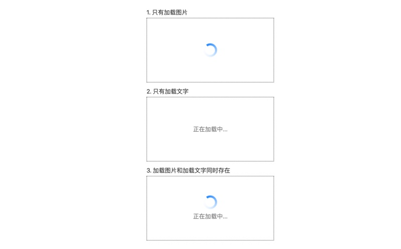

# Css

<!-- https://zhuanlan.zhihu.com/p/105856097?utm_source=wechat_session&utm_medium=social&utm_oi=987629092233142272 -->

## 1. :active伪类与CSS数据上报

> 如果想要知道两个按钮的点击率，CSS开发者可以自己动手，无需劳烦JavaScript开发者去埋点：

``` css
.button-1:active::after {
    content: url(./pixel.gif?action=click&id=button1);
    display: none;
}

.button-2:active::after {
    content: url(./pixel.gif?action=click&id=button2);
    display: none;
}
```

> 此时，当点击按钮的时候，相关行为数据就会上报给服务器，这种上报就算把JavaScript禁用掉也无法阻止，方便快捷，特别适合A/B测试。

### 2. 超实用超高频使用的:empty 伪类

> :empty 伪类用来匹配空标签元素，例如：
;

``` html
<div class="cs-empty"></div>
```

``` css
.cs-empty:empty{
    width: 120px;
    padding: 20px;
    border: 10px dashed;
}
```

此时，div 元素就会匹配 :empty 伪类，呈现出虚线框，如下图
;

#### 2.1 隐藏空元素

例如，某个模块里的内容是动态的，可能是列表，也可能是按钮，这些模块容器常包含影响布局的CSS属性，如margin、padding属性等。当然，这些模块里面有内容的时候，布局显示效果是非常好的，然儿一旦这些模块里面的内容为空，页面上就会有一块很大的明显的空白，效果就不好，这种情况下使用 :empty 伪类控制一下就再好不过了：

``` css
.cs-module:empty {
    display: none;
}
```

无需额外的JavaScript逻辑判断，直接使用CSS就可以实现动态样式效果，唯一需要注意的，当列表内容缺失的时候，一定要把空格也去掉，否则:empty 伪类不会匹配。

#### 2.2 字段缺失智能提示

例如，下面的HTML

``` html
<dl>
    <dt>姓名：</dt>
    <dd>张三</dd>
    <dt>性别：</dt>
    <dd></dd>
    <dt>手机：</dt>
    <dd></dd>
    <dt>邮箱：</dt>
    <dd></dd>
</dl>
```

用户某些信息字段是缺失的，此时由于开发人员应该使用其他占位字符示意这里没有内容，如短横线（-）或者直接使用文字提示。但是多年的开发经验告诉我，开发人员非常容易忘记这里的特殊处理，最终导致布局混乱，信息难懂。

``` css
dt {
    float: left;
}
```

但如今，我们就不用担心这样的合作问题了，直接使用CSS就可以处理这种情况，代码很简单：

``` css
dd:empty::before {
    content: '暂无';
    color: gray;
}
```

此时字段缺失后的布局效果如下：

#### 2.3 数据为空提示

实际开发中类似的场景还有很多。例如，表格中的备注信息经常都是空的，此时可以这样处理：

``` css
td:empty::before{
    content: '-';
    color: gray;
}
```

> 除此之外，还有一类典型场景需要用到 :empty 伪类，那就是动态Ajax加载数据为空的情况。当一个新用户进入一个产品的时候，很多模块内容是没有的。要是在过去，我们需要在Javascript代码中做 if 判断，如果没有值，我们要吐出”没有结果“或者”没有数据“的信息。但是现在，有了 :empty 伪类，直接把这个工作交给CSS就可以了。例如：

``` css
.cs-search-module:empty::before{
    content: '没有搜索结果'；
    display: block;
    line-height: 300px;
    text-align: center;
    color: gray;
}
```

又如：

``` css
.cs-article-module:empty::before{
    content: '您还没有发布任何文章'；
    display: block;
    line-height: 300px;
    text-align: center;
    color: gray;
}
```

> 总之，这种方法非常好用，可以节约大量的开发时间，同时体验更好，维护更方便，因为可以使用同一个类名使整站提示信息保持一致：

``` css
.cs-article-module:empty::before{
    content: '暂无数据；
    display: block;
    line-height: 300px;
    text-align: center;
    color: gray;
}
```

1. 用好:only-child伪类

- :only-child 是一个很给力的伪类，尤其在处理动态数据的时候，可以省去很多写JavaScript逻辑的成本。
- :only-child 意思是匹配没有任何兄弟元素的元素。例如，下面的 p 元素可以匹配 :only-child 伪类，因为其前后没有其他兄弟元素：

``` html
<div class="cs-confirm">
    <!-- 可以匹配:only-child伪类 -->
    <p class="cs-confirm-p">确定删除该内容？</p>
</div>
```

> 虽然 .icon 元素后面有删除文字，但由于没有标签嵌套，是匿名文本，因此不影响 .icon 元素匹配 :only-child 伪类。
> 尤其需要使用 :only-child 伪类的场景是动态场景，也就是某个固定小模块，根据场景的不用，里面可能是一个子元素，也可能是多个子元素，元素个数不同，布局方式也不同，此时就是 :only-child 伪类大放异彩的时候。例如，某个加载元素（loading）模块里面可能就只有一张加载图片，也可能仅仅就是一段加载描述文字，也可能是加载图片和加载文字同时出现，此时 :only-child 伪类就非常好用。

HTML示意如下：

``` html
<!-- 1. 只有加载图片 -->
<div class="cs-loading">
    
</div>
<!-- 2. 只有加载文字 -->
<div class="cs-loading">
    <p  class="cs-loading-p">正在加载中...</p>
</div>
<!-- 3. 加载图片和加载文字同时存在 -->
<div class="cs-loading">
    
    <p class="cs-loading-p">正在加载中...</p>
</div>
```

我们无需在父元素上专门指定额外的类名来控制不同状态的样式，直接活用 :only-child 伪类就可以让各种状态下布局都良好。

``` css
.cs-loading {
    height: 150px;
    position: relative;
    text-align: center;
    /* 与截图无关，截图示意用 */
    border: 1px dotted;
}

/* 图片和文字同时存在时在中间留点间距 */

.cs-loading-img {
    width: 32px; height: 32px;
    margin-top: 45px;
    vertical-align: bottom;
}

.cs-loading-p {
    margin: .5em  0  0;
    color: gray;
}

/* 只有图片的时候居中绝对定位 */
.cs-loading-img:only-child {
    position: absolute;
    left: 0; right: 0; top: 0; bottom: 0;
    margin: auto;
}

/* 只有文字的时候行号近似垂直居中 */
.cs-loading-p:only-child {
    margin: 0;
    line-height: 150px;
}
```

效果如下
;
