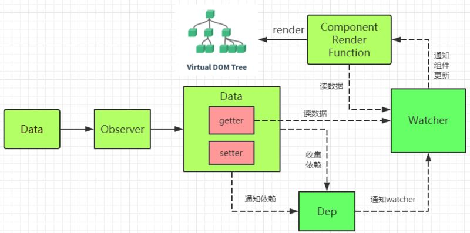

### Vue 响应式原理(概念)

;

#### 核心实现类:
* Observer : 它的作用是给对象的属性添加 getter 和 setter，用于依赖收集和派发更新

* Dep : 用于收集当前响应式对象的依赖关系,每个响应式对象包括子对象都拥有一个 Dep 实例（里面 subs 是 Watcher 实例数组）,当数据有变更时,会通过 dep.notify()通知各个 watcher。

* Watcher : 观察者对象 , 实例分为渲染 watcher (render watcher),计算属性 watcher (computed watcher),侦听器 watcher（user watcher）三种

* Watcher 和 Dep 的关系
watcher 中实例化了 dep 并向 dep.subs 中添加了订阅者,dep 通过 notify 遍历了 dep.subs 通知每个 watcher 更新。

#### 依赖收集
1. initState 时,对 computed 属性初始化时,触发 computed watcher 依赖收集
2. initState 时,对侦听属性初始化时,触发 user watcher 依赖收集
3. render()的过程,触发 render watcher 依赖收集
4. re-render 时,vm.render()再次执行,会移除所有 subs 中的 watcer 的订阅,重新赋值。
----
#### 派发更新
1. 组件中对响应的数据进行了修改,触发 setter 的逻辑
2. 调用 dep.notify()
3. 遍历所有的 subs（Watcher 实例）,调用每一个 watcher 的 update 方法。
##### 原理
* 当创建 Vue 实例时,vue 会遍历 data 选项的属性,利用 Object.defineProperty 为属性添加 getter 和 setter 对数据的读取进行劫持（getter 用来依赖收集,setter 用来派发更新）,并且在内部追踪依赖,在属性被访问和修改时通知变化。

* 每个组件实例会有相应的 watcher 实例,会在组件渲染的过程中记录依赖的所有数据属性（进行依赖收集,还有 computed watcher,user watcher 实例）,之后依赖项被改动时,setter 方法会通知依赖与此 data 的 watcher 实例重新计算（派发更新）,从而使它关联的组件重新渲染。
----
#### 一句话总结:

> vue.js 采用数据劫持结合发布-订阅模式,通过 Object.defineproperty 来劫持各个属性的 setter,getter,在数据变动时发布消息给订阅者,触发响应的监听回调