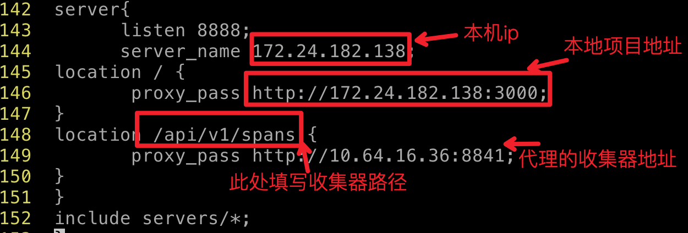
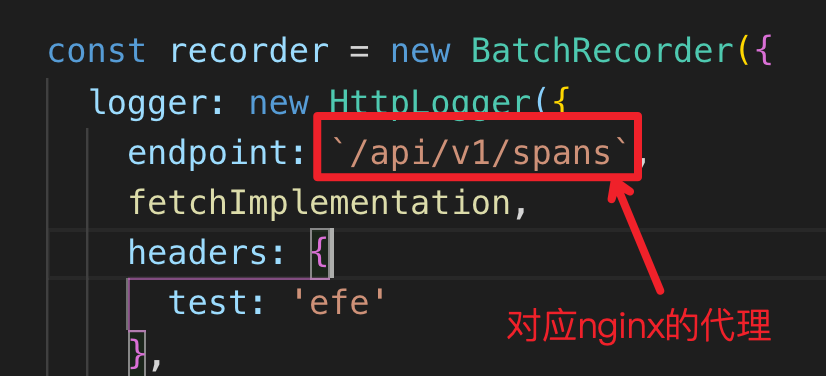
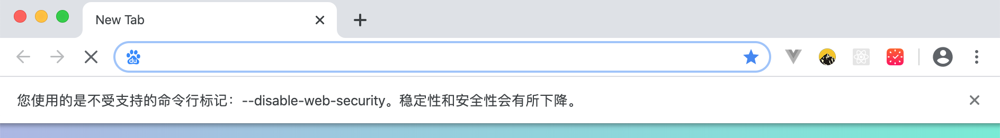

### nginx代理解决本地跨域

##### 1.1、背景描述
 * 背景：在使用zipkin-js中，正常业务请求后面会跟随一个收集器地址请求，收集器得到链路信息方便追踪查询问题。收集器地址和项目没在同一域名下，引起跨域问题。虽然收集器地址是后端配置的，但是引用的第三方插件，没有办法解决请求收集器地址出现的跨域问题。
 * 跨域出现是项目中请求了收集器地址，浏览器同源策略(协议，域名，端口有一不同，即为不同源)的限制引起的。
 * 解决跨域方法虽然比较多，但是服务器环境只能用代理的方式，nginx代理比node要简单，而且服务器环境大多配置了nginx，所以推荐使用，而本地调试关掉同源策略是最方便的。
##### 1.2、nginx代理(此处以本地作为例子)

###### 1.2.1、[安装nginx](https://segmentfault.com/a/1190000013781162)
mac安装[brew](https://brew.sh/index_zh-cn)之后，执行命令：
$ sudo brew install nginx
###### 1.2.2、nginx部分命令
 1. 查看nginx版本：nginx -v
 2. 启动nginx服务：
  * 运行命令：sudo brew services start nginx
  * 运行命令：nginx
 3. 关闭nginx服务：
 * 运行命令： sudo brew services stop nginx
 * 运行命令： nginx -s stop
      4.重启nginx服务：
 * sudo nginx -s reload
 * 平滑重启命令： kill -HUP nginx进程号
######1.2.3、 编辑 nginx.conf文件
在nginx目录下 用 vim 编辑  nginx.conf文件，具体如下，

> 如果是本地环境
``` javascript
  server{
     listen 8888;
     server_name 172.24.182.138;
     location / {
         proxy_pass http://172.24.182.138:3000;
    }
    location /api/v1/spans {
        proxy_pass http://jaeger-collector- beta.dev.weiyun.baidu.com:8626;
     }
   }
   ```
   ---------
> 如果是线上环境
``` javascript
 server{
    listen 8888;
    server_name localhost;
    location / {
        proxy_pass http://localhost:3000;
    }
    location /api/v1/spans {
       proxy_pass http://jaeger-collector-prod.weiyun.baidu.com:8624;
     }
  }
  ```
编辑成功后保存退出，重启 nginx
此时本地项目路径成为了  http://localhost:8888/  (172.24.182.138
是本机ip，可改为 localhost)
项目中请求收集地址就写代理路径，如下图

``` javascript
  const recorder = new BatchRecorder({
      logger: new HttpLogger({
          endpoint: `/api/v1/spans`,
           fetchImplementation
     })
 })
 ```
请求成功后查询
###### 1.3、本地调试解决
> 建议使用谷歌浏览器 关闭同源策略限制，在控制台输入命令
``` sh
open -a "Google Chrome" --args --disable-web-security  --user-data-dir
```
> ！！！注意： 要彻底关闭谷歌浏览器，用命令打开，出现如下提示说明成功   
