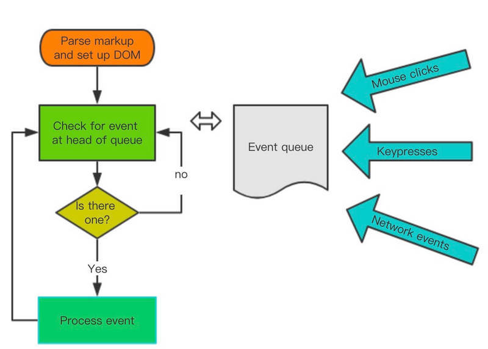

### 谈一谈 nextTick 的原理

##### JS 运行机制
###### JS 执行是单线程的，它是基于事件循环的。事件循环大致分为以下几个步骤:

* 所有同步任务都在主线程上执行，形成一个执行栈（execution context stack）。
* 主线程之外，还存在一个"任务队列"（task queue）。只要异步任务有了运行结果，就在"任务队列"之中放置一个事件。
* 一旦"执行栈"中的所有同步任务执行完毕，系统就会读取"任务队列"，看看里面有哪些事件。那些对应的异步任务，于是结束等待状态，进入执行栈，开始执行。
* 主线程不断重复上面的第三步。



主线程的执行过程就是一个 tick，而所有的异步结果都是通过 “任务队列” 来调度。 消息队列中存放的是一个个的任务（task）。 规范中规定 task 分为两大类，分别是 macro task 和 micro task，并且每个 macro task 结束后，都要清空所有的 micro task。

``` javascript
for (macroTask of macroTaskQueue) {
  // 1. Handle current MACRO-TASK
  handleMacroTask();

  // 2. Handle all MICRO-TASK
  for (microTask of microTaskQueue) {
    handleMicroTask(microTask);
  }
}
```

在浏览器环境中 :

常见的 macro task 有 setTimeout、MessageChannel、postMessage、setImmediate

常见的 micro task 有 MutationObsever 和 Promise.then

##### 异步更新队列
* 可能你还没有注意到，Vue 在更新 DOM 时是异步执行的。只要侦听到数据变化，Vue 将开启一个队列，并缓冲在同一事件循环中发生的所有数据变更。

* 如果同一个 watcher 被多次触发，只会被推入到队列中一次。这种在缓冲时去除重复数据对于避免不必要的计算和 DOM 操作是非常重要的。

* 然后，在下一个的事件循环“tick”中，Vue 刷新队列并执行实际 (已去重的) 工作。

* Vue 在内部对异步队列尝试使用原生的 Promise.then、MutationObserver 和 setImmediate，如果执行环境不支持，则会采用 setTimeout(fn, 0) 代替。

* 在 vue2.5 的源码中，macrotask 降级的方案依次是：setImmediate、MessageChannel、setTimeout

###### vue 的 nextTick 方法的实现原理:

1. vue 用异步队列的方式来控制 DOM 更新和 nextTick 回调先后执行
2. microtask 因为其高优先级特性，能确保队列中的微任务在一次事件循环前被执行完毕
3. 考虑兼容问题,vue 做了 microtask 向 macrotask 的降级方案
