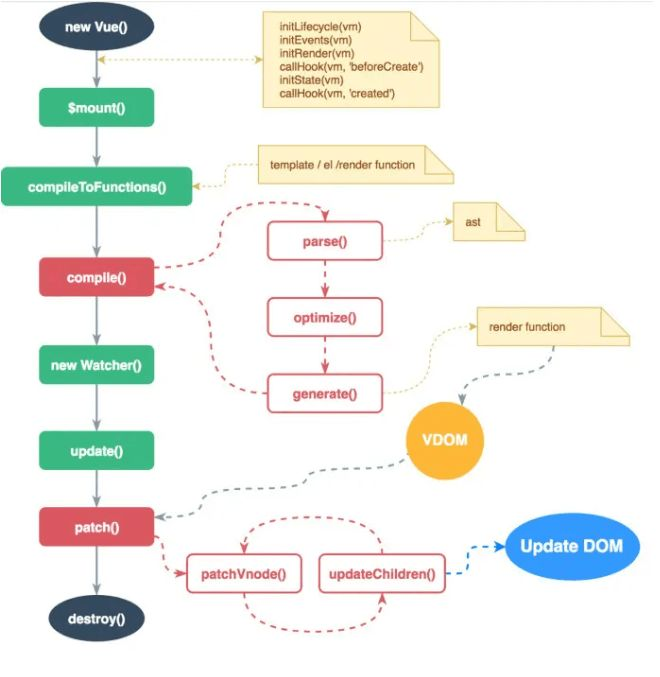

### 说说 Vue 的渲染过程

1. 调用 compile 函数,生成 render 函数字符串 ,编译过程如下:
* parse 函数解析 template,生成 ast(抽象语法树)
* optimize 函数优化静态节点 (标记不需要每次都更新的内容,diff 算法会直接跳过静态节点,从而减少比较的过程,优化了 patch 的性能)
* generate 函数生成 render 函数字符串
2. 调用 new Watcher 函数,监听数据的变化,当数据发生变化时，Render 函数执行生成 vnode 对象
3. 调用 patch 方法,对比新旧 vnode 对象,通过 DOM diff 算法,添加、修改、删除真正的 DOM 元素
