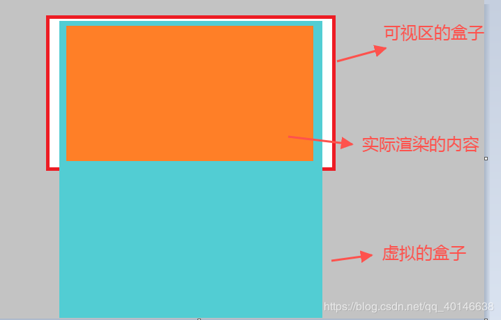

##### Vue虚拟滚动原理

> 主要用于长列表首屏加载速度慢问题，DOM加载过多“无用”元素。
> 原理：
;

1. 创建一个虚拟的盒子用于显示滚动条(虚拟盒子的高度/宽度要根据总数据的条数和每条子元素的大小来确定);
2. 虚拟的盒子要根据可视区的盒子进行定位,不然会把实际渲染内容挤到最下面去;
3. 实际渲染的盒子需要使用translate3d属性确定它距离顶部的位置;
4. 根据可视区盒子的滚动距离来动态切割渲染的数据;

正常项目中可以使用[Vue-Virtual-Scroller](https://github.com/Akryum/vue-virtual-scroller)组件
