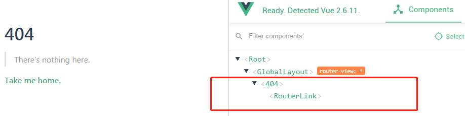
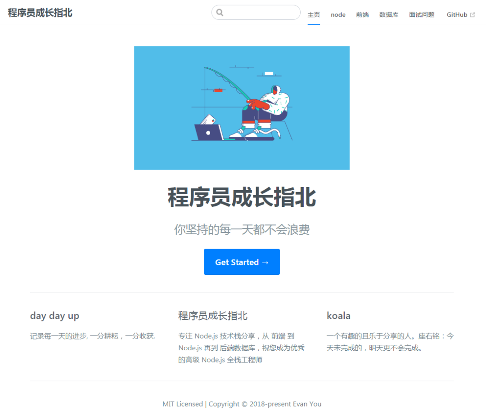
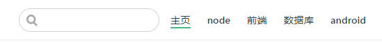
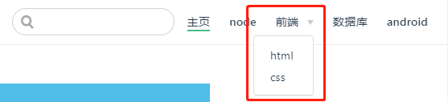
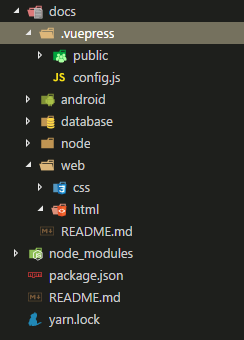
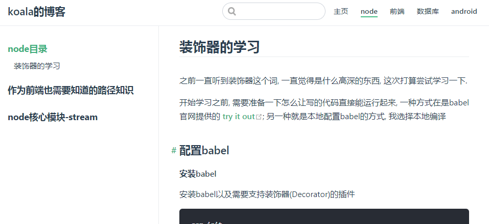
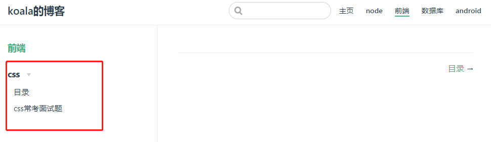

### 为什么选择vuepress

* 为技术文档而优化的内置Markdown拓展
* 在Markdown文件中使用Vue组件的能力
* Vue驱动的自定义主题系统
* 自动生成Service Worker(支持PWA)
* Google Analytics集成
* 基于Git的"最后更新时间
* 多语言支持
* 响应式布局
* 支持PWA模式

#### 项目搭建

> 安装vuepress: 如果使用npm来安装, Node.js版本需要 >=8 才可以

``` sh
yarn global add vuepress # 或者：npm install -g vuepress
```

> 注意: 如果你的现有项目依赖了 webpack 3.x，推荐使用 Yarn而不是 npm 来安装 VuePress。因为在这种情形下，npm 会生成错误的依赖树。

#### 初始化项目

``` sh
mkdir blog
cd blog
yarn init -y # 或者 npm init -y
```

初始化完成后, 会创建一个package.json

``` javascript
{
  "name":"blog",  
  "version": "1.0.0",
  "main": "index.js",
  "license": "MIT"
  "scripts": {
     "test": "echo \"Error: no test specified\" && exit 1"
  }
}
```

在package.json中, 配置启动命令

``` javascript
"scripts": {
    "docs:dev": "vuepress dev docs",
    "docs:build": "vuepress build docs"
  }
```

启动项目:  npm run docs:dev  这条命令就等于 vuepress dev docs
打包项目: npm run build 这条命令就等于 vuepress build docs
创建docs目录, 主要用于放置我们写的.md类型的文章以及.vuepress相关的配置

``` sh
mkdir docs
```

接着在docs文件夹中创建.vuepress文件夹

``` sh
cd docs
mkdir .vuepress
```

这个文件主要就是放vuepress相关的配置

#### 页面具体内容配置

##### 基本配置

接下来要让页面显示内容, 就需要进行配置, 新建一个总的配置文件config.js, 这个文件的名字是固定的.

``` sh
cd .vuepress
touch config.js
```

config.js最基础的配置文件内容如下:

``` javascript
module.exports = {
    title: 'koala的博客',
    description: '专注 Node.js 技术栈分享，从前端到Node.js再到数据库',
}
```

>如果这时运行npm run docs:dev或者yarn docs:dev, 会出现页面404页面,vuepress默认打开的是docs下的readme.md文件, 由于你没有创建,所以找到的是vuepress默认提供的404页面, 关于这有点,我们借助vue-devtools工具来查看一下vue的结构

在docs目录下创建README.md文件, 再运行,就可以看到运行起来的效果

#### 设置封面页

此时README文件中没有内容,封面页是空的, 我们可以通过在这个markdown文件中写一些内容, 同时官方也给我们提供了封面页的模板(个人觉得还是比较实用的):

``` md
---
home: true
heroImage: /home.png
actionText: Get Started →
actionLink: /node/
features:
- title: day day up
  details: 记录每一天的进步, 一分耕耘，一分收获.
- title: 程序员成长指北
  details: 专注 Node.js 技术栈分享，从 前端 到 Node.js 再到 后端数据库，祝您成为优秀的高级 Node.js 全栈工程师
- title: koala
  details: 一个有趣的且乐于分享的人。座右铭：今天未完成的，明天更不会完成。
footer: MIT Licensed | Copyright © 2018-present Evan You

---
```

效果图如下:

配置导航栏nav

在config.js中添加:

``` javascript
themeConfig:{
  nav: [{text: "主页", link: "/"      },
      { text: "node", link: "/node/" },
      { text: "前端", link: "/webframe/"},
      { text: "数据库", link: "/database/"   },
      { text: "android", link: "/android/"   },
      { text: "面试问题", link: "/interview/" }
    ],
}
```

效果如下图:


如果想要展示二级导航, 可以这样配置:

``` javascript
themeConfig:{
  nav: [{text: "主页", link: "/"      },
      { text: "node", link: "/node/" },
      { text: "前端",
        items: [
          { text: "html", link:"/web/html/"},
          { text: "css", link:"/web/css/"},
          ]
      },
      { text: "数据库", link: "/database/"   },
      { text: "android", link: "/android/"   },
      { text: "面试问题", link: "/interview/" }
    ],
}
```

效果如图所示:

> 当你使用上面的方式配置nav时, 目录结构最好和我创建的一样 项目目录结构如下:

导航栏创建好了, 接下来就是配置页面内容中的侧边栏slider

#### 配置侧边栏slider

##### 1.自动获取侧边栏内容

如果你希望自动生成当前页面标题的侧边栏, 可以在config.js中配置来启用

``` javascript
// .vuepress/config.js
module.exports = {
  themeConfig:{
    sidebar: 'auto',
    // sidebarDepth: 1
  }
}
```

##### 2.展示每个页面的侧边栏

> 如果你希望为不同的页面组显示不同的侧边栏, 就和官网一样, 点击指南显示的是对应的侧边栏,目前目录有node \ database \ web等, 这些目录下都存放着多个md文件:

``` javascript
module.exports = {
  themeConfig:{
    sidebar:{
      "/node/":[
        ["", "node目录"],
        ["path", "作为前端也需要知道的路径知识"],
        ["stream", "node核心模块-stream"]
      ],
      "/web/":[
        ["", "前端"],
        {
          title: "css",
          name: "css",
          collabsable: false,
          children: [
            ["css/", "目录"],
            ['css/1', "css常考面试题"]
          ]
        }
      ]
    }
  }
}
```

设置的效果图如下: 在node导航下:

在前端导航下的效果:

上面采用了两个方式配置侧边栏, 一个侧边栏是node目录下直接是写的markdown文章, 而在web下又有多个分类, 所有有进行了分栏配置, 其实这两种方式在我们博客中都是比较常见的

#### 自定义布局内容

网站的导航和侧边栏都已经配置好之后, 如果你觉得页面不是很符合你的预期, 你也可以自定修改成你想要的效果。比如就像我的博客中左侧固定的内容, 就是自定义的全局组件. 这里使用vuepress提供的插件机制来实现

在.vuepress文件夹下创建components文件夹, 在components下再创建fixed.vue文件

``` vue
<template>
  <div class="fixed_container">
  </div>
</template>
<script>
export default {
  name: 'fixed'
}
</script>
```

然后在配置文件中以插件的形式配置即可:

``` javascript
  // 插件
  plugins:[
    {
      name:"page-plugin",
      globalUIComponents:["fixed"],
    }
  ]
```

globalUIComponents是用于注入全局的UI, 它以数组的形式接收参数名字, 这里的名字必须与components文件夹下的.vue文件同名, 全局UI就是一个Vue组件; 其实vuepress也提供了一些内置的全局UI组件, 例如:back-to-top, popup, nprogress等.

#### UI插件

配置内置的全局UI,首先需要插件:

``` sh
yarn add -D @vuepress/plugin-back-to-top @vuepress/plugin-nprogress
# OR npm install -D @vuepress/plugin-back-to-top  @vuepress/plugin-nprogress
```

在config.js中配置:

``` javascript
  plugins:[
   ["@vuepress/back-to-top"], // 返回顶部
   ["@vuepress/nprogress"],   // 加载进度条
  ]
```

> 这里需要注意一点就是看你项目中是否安装了vuepress, 由于我之前是全局安装的, 在项目下还没有安装, 插件是依赖于vuepress的, 所有没有安装的需要安装上, 插件才有效.

#### 支持PWA

vuepress还有一个我比较看重的优势, 就是支持PWA, 当用户没有网的情况下,一样能继续的访问我们的网站
在0.x 版本中我们只要配置serviceWorker: true 即可, 但是我们现在使用的是1.2.0版本, 这个版本中已经将这个功能抽离出来作为插件的方式使用, 下面就看一下具体如何使用的:
首先需要安装插件:

``` sh
yarn add -D @vuepress/plugin-pwa
# 或者 npm install -D @vuepress/plugin-pwa
```

在config.js中配置:

``` javascript
module.exports = {
  plugins: ['@vuepress/pwa', {
    serviceWorker: true,
    updatePopup: true
  }]
}
```

> 注意点:
> 为了让你的网站完全地兼容 PWA，你需要:
> 在 .vuepress/public 提供 Manifest 和 icons
> 在 .vuepress/config.js 添加正确的 head links

``` javascript
// 配置
module.exports = {
  head: [
    ['link', { rel: 'icon', href: `/favicon.ico` }],
    //增加manifest.json
    ['link', { rel: 'manifest', href: '/manifest.json' }],
  ],
}
```

manifest.json 文件

``` javascript
{
  "name": "koala_blog",
  "short_name": "blog",
  "version": "1.0.0",
  "description": "程序员成长指北博主, koala的博客",
  "manifest_version": 2
}
```

#### valine 使用

点击进入 Valine官网 ，需要先注册才能使用.
然后创建应用, 获取APP ID 和APP KEY

应用创建好以后，进入刚刚创建的应用，选择左下角的设置 > 应用Key，然后就能看到你的APP ID 和APP Key了
安装:

``` sh
yarn add vuepress-plugin-comment -D
```

##### 快速使用

在.vuepress下的config.js插件配置中:

``` javascript
module.exports = {
  plugins: [
    [
      'vuepress-plugin-comment',
      {
        choosen: 'valine',
        // options选项中的所有参数，会传给Valine的配置
        options: {
          el: '#valine-vuepress-comment',
          appId: 'Your own appId',
          appKey: 'Your own appKey'
        }
      }
    ]
  ]
}
```

appid和appkey为你创建的应用的APP ID 和APP Key
gitTalk 使用

##### 主题样式修改

vuepress默认是主题颜色是绿色, 如果你不喜欢可以对其进行更改. 如果要对默认设置的样式进行简单颜色替换, 或者自定义一些颜色变量供以后使用, 可以在.vuepress/styles下创建palette.styl文件.
你可以调整的颜色变量:

``` javascript
// 颜色
$textColor ?= #2c3e50
$accentColor ?= #1e90ff
$grayTextColor ?= #666
$lightTextColor ?= #999
$borderColor ?= #eaecef
$codeBgColor ?= #282c34
$arrowBgColor ?= #ccc
$navbarColor ?= #fff
$headerColor ?= #fff
$headerTitleColor ?= #fff
$nprogressColor ?= $accentColor

// 布局
$navbarHeight ?= 3.6rem
$bannerHeight ?= 12rem

// 响应式 breakpoints
$MQWide ?= 1440px
$MQNarrow ?= 1024px
$MQMobile ?= 768px
$MQMobileNarrow ?= 480px
```

> 注意点: 你应该只在这个文件中写入颜色变量。因为 palette.styl 将在根的 stylus 配置文件的末尾引入，作为配置，它将被多个文件使用，所以一旦你在这里写了样式，你的样式就会被多次复制
如果要添加额外的样式, vuepress也是提供了简便方法的, 只要在.vuepress/styles文件下创建一个 index.styl, 在里面写css样式即可, 注意文件命名是固定的.

#### 部署

##### nginx部署

我的博客采用的是静态文件部署, 感觉方便又便捷, 之前部署在Github Pages上, 访问速度不是很理想.
第一步: 确保你满足下面几个条件
你有一台服务器
已经安装好nginx, 如果不会的小伙伴请看如何安装nginx
解析了一个可用的域名
第二步: 打包你的项目
运行npm run docs:build将项目打包, 默认打包文件在docs/.vuepress/dist目录下
第三步: 配置nginx
进入到nginx 配置目录, 找到conf.d文件, 添加下面的配置:

``` sh
server {
    listen       80;
    server_name  www.inode.club;

    root     /usr/web/inode/dist;

    error_log   /var/log/nginx/inode-error.log;
    access_log  /var/log/nginx/inode-access.log;

    #        deny all;
    index  index.php index.html index.htm;
}
```

server_name 是你解析的域名地址
root 配置文件将访问的静态资源文件的路径
**第四步: 上传静态资源文件 **
将静态资源文件放置到服务器上, 路径为配置的/usr/web/inode/dist, 可以借助xftp工具上传也可以通过git克隆, 选择适合自己的方式就可以
**第五步: 重启nginx **

###### 重启之前务必检查配置是否正确

``` javascript
sudo nginx -t  // 检查配置
sudo nginx -s reload  // 重启
```

然后你就可以通过域名来访问你的网站啦!

#### github部署

##### 第一步: 首先确保你的项目满足以下几个条件

文档放置在docs目录中
使用的是默认的构建输出位置
vuepress以本地依赖的形式被安装到你的项目中, 在根目录package.json文件中包含如下代码:

``` javascript
// 配置npm scripts
"scripts": {
    "docs:dev": "vuepress dev docs",
    "docs:build": "vuepress build docs"
 }

// VuePress 以本地依赖的形式被安装
"devDependencies": {
  "vuepress": "^1.2.0"
}
```

##### 第二步: 创建github仓库

在github上创建一个名为blog的仓库, 并将代码提交到github上

##### 第三步: 配置仓库名称

配置docs/.vuepress/config.js文件中的base, 如果打算发布到https://<USERNAME>.github.io/<REPO>/(也就是说你的仓库在:  https://github.com/<USERNAME>/<REPO> ), 此处我的仓库为: blog, 则将base按照如下配置即可:

``` javascript
module.exports = {
  base: "/blog/"
}
```

第四步: 在项目根目录中,创建一个如下的脚本文件deploy.sh

#!/usr/bin/env sh

##### 确保脚本抛出遇到的错误

``` sh
set -e
```

##### 生成静态文件

``` sh
npm run docs:build
```

##### 进入生成的文件夹

``` sh
cd docs/.vuepress/dist

git init
git add -A
git commit -m 'deploy'

# 如果发布到 https://<USERNAME>.github.io/<REPO>
git push -f git@github.com:<USERNAME>/<REPO>.git master:gh-pages
# 例如 git push -f git@github.com:koala-coding/blog.git master:gh-pages
cd -
```

##### 第五步: 双击 deploy.sh 运行脚本

会自动在我们的 GitHub 仓库中，创建一个名为 gh-pages 的分支，而我们要部署到 GitHub Pages 的正是这个分支

##### 第六步

setting Github Pages这是最后一步了，在 GitHub 项目点击 Setting 按钮，找到 GitHub Pages - Source，选择 gh-pages 分支，点击 Save 按钮后，静静地等待它部署完成即可。
