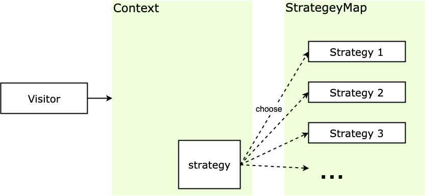

# Vue策略模式实现动态表单验证

策略模式 （Strategy Pattern）又称政策模式，其定义一系列的算法，把它们一个个封装起来，并且使它们可以互相替换。封装的策略算法一般是独立的，策略模式根据输入来调整采用哪个算法。关键是策略的实现和使用分离。

> 注意： 本文可能用到一些编码技巧比如 IIFE（Immediately Invoked Function Expression, 立即调用函数表达式），ES6 的语法 let/const、箭头函数、rest 参数，短路运算符 等，如果还没接触过可以点击链接稍加学习 ~

### 你曾见过的策略模式

现在电子产品种类繁多，尺寸多种多样，有时候你会忍不住想拆开看看里面啥样（想想小时候拆的玩具车还有遥控器），但是螺丝规格很多，螺丝刀尺寸也不少，如果每碰到一种规格就买一个螺丝刀，家里就得堆满螺丝刀了。所以现在人们都用多功能的螺丝刀套装，螺丝刀把只需要一个，碰到不同规格的螺丝只要换螺丝刀头就行了，很方便，体积也变小很多。

再举个栗子，一辆车的轮胎有很多规格，在泥泞路段开的多的时候可以用泥地胎，在雪地开得多可以用雪地胎，高速公路上开的多的时候使用高性能轮胎，针对不同使用场景更换不同的轮胎即可，不需更换整个车。

这些都是策略模式的实例，螺丝刀/车属于封装上下文，封装和使用不同的螺丝刀头/轮胎，螺丝刀头/轮胎这里就相当于策略，可以根据需求不同来更换不同的使用策略。

在这些场景中，有以下特点：

- 螺丝刀头/轮胎（策略）之间相互独立，但又可以相互替换；

- 螺丝刀/车（封装上下文）可以根据需要的不同选用不同的策略；

### 实例的代码实现

具体的例子我们用编程上的例子来演示，比较好量化。
场景是这样的，某个电商网站希望举办一个活动，通过打折促销来销售库存物品，有的商品满 100 减 30，有的商品满 200 减 80，有的商品直接8折出售（想起被双十一支配的恐惧），这样的逻辑交给我们，我们要怎样去实现呢。

``` javascript
function priceCalculate(discountType, price) {
    if (discountType === 'minus100_30') {   		// 满100减30
        return price - Math.floor(price / 100) * 30
    }
    else if (discountType === 'minus200_80') {  // 满200减80
        return price - Math.floor(price / 200) * 80
    }
    else if (discountType === 'percent80') {    // 8折
        return price * 0.8
    }
}

priceCalculate('minus100_30', 270)    // 输出: 210
priceCalculate('percent80', 250)      // 输出: 200
```

通过判断输入的折扣类型来计算计算商品总价的方式，几个 **if-else** 就满足了需求，但是这样的做法的缺点也很明显：

- **priceCalculate** 函数随着折扣类型的增多，**if-else** 判断语句会变得越来越臃肿；
  
- 如果增加了新的折扣类型或者折扣类型的算法有所改变，那么需要更改 **priceCalculate** 函数的实现，这是违反开放-封闭原则的；

- 可复用性差，如果在其他的地方也有类似这样的算法，但规则不一样，上述代码不能复用；

我们可以改造一下，将计算折扣的算法部分提取出来保存为一个对象，折扣的类型作为 key，这样索引的时候通过对象的键值索引调用具体的算法：

``` javascript
const DiscountMap = {
    minus100_30: function(price) {
        return price - Math.floor(price / 100) * 30
    },
    minus200_80: function(price) {
        return price - Math.floor(price / 200) * 80
    },
    percent80: function(price) {
        return price * 0.8
    }
}

/* 计算总售价*/
function priceCalculate(discountType, price) {
    return DiscountMap[discountType] && DiscountMap[discountType](price)
}

priceCalculate('minus100_30', 270)
priceCalculate('percent80', 250)

// 输出: 210
// 输出: 200
```

这样算法的实现和算法的使用就被分开了，想添加新的算法也变得十分简单：

``` javascript
DiscountMap.minus150_40 = function(price) {
    return price - Math.floor(price / 150) * 40
}
```

如果你希望计算算法隐藏起来，那么可以借助 IIFE 使用闭包的方式，这时需要添加增加策略的入口，以方便扩展：

``` javascript
const PriceCalculate = (function() {
    /* 售价计算方式 */
    const DiscountMap = {
        minus100_30: function(price) {      // 满100减30
            return price - Math.floor(price / 100) * 30
        },
        minus200_80: function(price) {      // 满200减80
            return price - Math.floor(price / 200) * 80
        },
        percent80: function(price) {        // 8折
            return price * 0.8
        }
    }
    return {
        priceClac: function(discountType, price) {
            return DiscountMap[discountType] && DiscountMap[discountType](price)
        },
        addStrategy: function(discountType, fn) {
            // 注册新计算方式
            if (DiscountMap[discountType]) return
            DiscountMap[discountType] = fn
        }
    }
})()

PriceCalculate.priceClac('minus100_30', 270) // 输出: 210

PriceCalculate.addStrategy('minus150_40', function(price) {
    return price - Math.floor(price / 150) * 40
})
PriceCalculate.priceClac('minus150_40', 270) // 输出: 230
```

这样算法就被隐藏起来，并且预留了增加策略的入口，便于扩展。

### 策略模式的通用实现

根据上面的例子提炼一下策略模式，折扣计算方式可以被认为是策略 **（Strategy）**，这些策略之间可以相互替代，而具体折扣的计算过程可以被认为是封装上下文 **（Context）**，封装上下文可以根据需要选择不同的策略。
主要有下面几个概念：

- **Context** ：封装上下文，根据需要调用需要的策略，屏蔽外界对策略的直接调用，只对外提供一个接口，根据需要调用对应的策略；
- **Strategy** ：策略，含有具体的算法，其方法的外观相同，因此可以互相代替；
- **StrategyMap** ：所有策略的合集，供封装上下文调用；
- 
结构图如下：

策略模式
下面使用通用化的方法实现一下。

``` javascript
const StrategyMap = {}

function context(type, ...rest) {
    return StrategyMap[type] && StrategyMap[type](...rest)
}

StrategyMap.minus100_30 = function(price) {
    return price - Math.floor(price / 100) * 30
}

context('minus100_30', 270) // 输出: 210
```

### 实战中的策略模式

#### 表格 formatter

这里举一个 **Vue + ElementUI** 项目中用到的例子，其他框架的项目原理也类似，和大家分享一下。

**Element** 的表格控件的 **Column** 接受一个 **formatter** 参数，用来格式化内容，其类型为函数，并且还可以接受几个特定参数，像这样：

Function(row, column, cellValue, index)。

以文件大小转化为例，后端经常会直接传 bit 单位的文件大小，那么前端需要根据后端的数据，根据需求转化为自己需要的单位的文件大小，比如 KB/MB。

首先实现文件计算的算法：

``` javascript
export const StrategyMap = {
    /* Strategy 1: 将文件大小（bit）转化为 KB */
    bitToKB: val => {
        const num = Number(val)
        return isNaN(num) ? val : (num / 1024).toFixed(0) + 'KB'
    },
    /* Strategy 2: 将文件大小（bit）转化为 MB */
    bitToMB: val => {
        const num = Number(val)
        return isNaN(num) ? val : (num / 1024 / 1024).toFixed(1) + 'MB'
    }
}

/* Context: 生成el表单 formatter */
const strategyContext = function(type, rowKey){
  return function(row, column, cellValue, index){
    return StrategyMap[type](row[rowKey])
  }
}

export default strategyContext
```

那么在组件中我们可以直接：

``` html
<template>
    <el-table :data="tableData">
        <el-table-column prop="date" label="日期"></el-table-column>
        <el-table-column prop="name" label="文件名"></el-table-column>
        <!-- 直接调用 strategyContext -->
        <el-table-column prop="sizeKb" label="文件大小(KB)"
                         :formatter='strategyContext("bitToKB", "sizeKb")'>
        </el-table-column>
        <el-table-column prop="sizeMb" label="附件大小(MB)"
                         :formatter='strategyContext("bitToMB", "sizeMb")'>
        </el-table-column>
    </el-table>
</template>

<script type='text/javascript'>
    import strategyContext from './strategyContext.js'
    export default {
        name: 'ElTableDemo',
        data() {
            return {
                strategyContext,
                tableData: [
                    { date: '2019-05-02', name: '文件1', sizeKb: 1234, sizeMb: 1234426 },
                    { date: '2019-05-04', name: '文件2', sizeKb: 4213, sizeMb: 8636152 }]
            }
        }
    }
</script>

<style scoped></style>
```

代码实例可以参看 **codepen** - 策略模式实战
运行结果如下图：


#### 表单验证

1. 除了表格中的 **formatter** 之外，策略模式也经常用在表单验证的场景，这里举一个 **Vue + ElementUI** 项目的例子，其他框架同理。
2. **ElementUI** 的 **Form** 表单 具有表单验证功能，用来校验用户输入的表单内容。实际需求中表单验证项一般会比较复杂，所以需要给每个表单项增加 **validator** 自定义校验方法。
3. 我们可以像官网示例一样把表单验证都写在组件的状态 **data** 函数中，但是这样就不好复用使用频率比较高的表单验证方法了，这时我们可以结合策略模式和函数柯里化的知识来重构一下。首先我们在项目的工具模块（一般是 **utils** 文件夹）实现通用的表单验证方法：

``` javascript
// src/utils/validates.js

/* 姓名校验 由2-10位汉字组成 */
export function validateUsername(str) {
    const reg = /^[\u4e00-\u9fa5]{2,10}$/
    return reg.test(str)
}

/* 手机号校验 由以1开头的11位数字组成  */
export function validateMobile(str) {
    const reg = /^1\d{10}$/
    return reg.test(str)
}

/* 邮箱校验 */
export function validateEmail(str) {
    const reg = /^[a-zA-Z0-9_-]+@[a-zA-Z0-9_-]+(\.[a-zA-Z0-9_-]+)+$/
    return reg.test(str)
}
然后在 utils/index.js 中增加一个柯里化方法，用来生成表单验证函数：
// src/utils/index.js

import * as Validates from './validates.js'

/* 生成表格自定义校验函数 */
export const formValidateGene = (key, msg) => (rule, value, cb) => {
    if (Validates[key](value)) {
        cb()
    } else {
        cb(new Error(msg))
    }
}
```

上面的 **formValidateGene** 函数接受两个参数，第一个是验证规则，也就是 **src/utils/validates.js** 文件中提取出来的通用验证规则的方法名，第二个参数是报错的话表单验证的提示信息。

``` html
<template>
    <el-form ref="ruleForm"
             label-width="100px"
             class="demo-ruleForm"
             :rules="rules"
             :model="ruleForm">
        <el-form-item label="用户名" prop="username">
            <el-input v-model="ruleForm.username"></el-input>
        </el-form-item>
        <el-form-item label="手机号" prop="mobile">
            <el-input v-model="ruleForm.mobile"></el-input>
        </el-form-item>
        <el-form-item label="邮箱" prop="email">
            <el-input v-model="ruleForm.email"></el-input>
        </el-form-item>
    </el-form>
</template>

<script type='text/javascript'>
    import * as Utils from '../utils';
    export default {
        name: 'ElTableDemo',
        data() {
            return {
                ruleForm: { pass: '', checkPass: '', age: '' },
                rules: {
                    username: [{
                        validator: Utils.formValidateGene('validateUsername', '姓名由2-10位汉字组成'),
                        trigger: 'blur'
                    }],
                    mobile: [{
                        validator: Utils.formValidateGene('validateMobile', '手机号由以1开头的11位数字组成'),
                        trigger: 'blur'
                    }],
                    email: [{
                        validator: Utils.formValidateGene('validateEmail', '不是正确的邮箱格式'),
                        trigger: 'blur'
                    }]
                }
            }
        }
    }
</script>
```

可以看见在使用的时候非常方便，把表单验证方法提取出来作为策略，使用柯里化方法动态选择表单验证方法，从而对策略灵活运用，大大加快开发效率。
代码实例可以参看 **codesandbox** - 策略模式表单验证实战
运行结果：

### 策略模式的优缺点

策略模式将算法的实现和使用拆分，这个特点带来了很多优点：

- 策略之间相互独立，但策略可以自由切换，这个策略模式的特点给策略模式带来很多灵活性，也提高了策略的复用率；
- 如果不采用策略模式，那么在选策略时一般会采用多重的条件判断，采用策略模式可以避免多重条件判断，增加可维护性；
- 可扩展性好，策略可以很方便的进行扩展；
  
策略模式的缺点：

- 策略相互独立，因此一些复杂的算法逻辑无法共享，造成一些资源浪费；
- 如果用户想采用什么策略，必须了解策略的实现，因此所有策略都需向外暴露，这是违背迪米特法则/最少知识原则的，也增加了用户对策略对象的使用成本。

### 策略模式的适用场景

那么应该在什么场景下使用策略模式呢：

- 多个算法只在行为上稍有不同的场景，这时可以使用策略模式来动态选择算法；
- 算法需要自由切换的场景；
- 有时需要多重条件判断，那么可以使用策略模式来规避多重条件判断的情况；

### 策略模式和模板方法模式

- 策略模式和模板方法模式的作用比较类似，但是结构和实现方式有点不一样。
- 策略模式 让我们在程序运行的时候动态地指定要使用的算法；
- 模板方法模式 是在子类定义的时候就已经确定了使用的算法；
