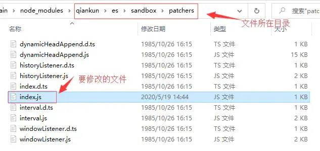
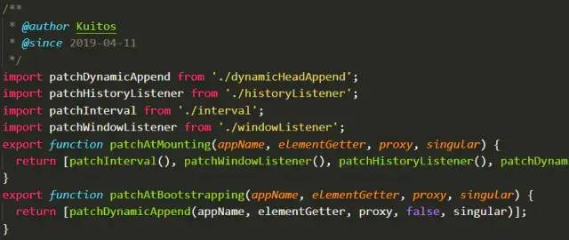
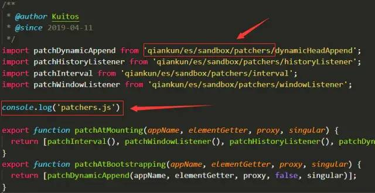
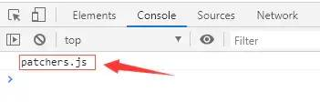

# 如何科学修改 node_modules 里的文件

有时候使用npm上的包，发现有bug，我们知道如何修改，但是别人可能一时半会没法更新，或者是我们特殊需求，别人不愿意修改，这时候我们只能自己动手丰衣足食。那么我们应该如何修改别人的源码呢？首先，直接修改node_modules里面的文件是不太行的，重新安装依赖就没有了。一般常用办法有两个：
下载别人代码到本地，放在src目录，修改后手动引入。
fork别人的代码到自己仓库，修改后，从自己仓库安装这个插件。
这两个办法的缺陷就是：更新麻烦，我们每次都需要手动去更新代码，无法与插件同步更新。如果我们要修改的代码仅仅是别人的一个小模块，其他大部分代码都不动，这时候有一个很投机的操作：利用 webpack alias 来覆盖别人代码。

## webpack alias 的作用

webpack alias一般用来配置路径别名，使我们可以少写路径代码：

``` javascript
chainWebpack: config => {
    config.resolve.alias
      .set('@', resolve('src'))
      .set('#', resolve('src/views/page1'))
      .set('&', resolve('src/views/page2'));
},
```

也就是说，**webpack alias**会替换我们写的“简写路径”，并且它对**node_modules**里面的文件也是生效的。这时候我们可以将别人源码里面引用模块的路径替换成我们自己的文件。
具体操作如下：

1. 找到别人源码里面的需要修改的模块，复制代码到src目录
2. 修改其中的bug，注意里面引用其他的文件都需要写成绝对路径
3. 找到这个模块被引入的路径（我们需要拦截的路径）
4. 配置webpack alias

实际操作一下,以**qiankun**框架的**patchers**模块为例：



文件被引用的路径为：**./patchers**（我们要拦截的路径）


文件内容为：



复制内容到**src/assets/patchers.js**，修改其 import 路径为绝对路径，并添加我们的代码：



配置**webpack alias**（我用的是vue-cli4，配置文件是vue.config.js）:



``` javascript
const path = require('path');
module.exports = {
  chainWebpack: config => {
    config.resolve.alias
      .set('./patchers', path.resolve(__dirname, 'src/assets/patchers.js'))
  }
};
```

运行代码，控制台打印成功，表明我们已经成功覆盖别人的代码，而且别人的代码有更新时，我们也可以同步更新，只是这个模块的代码使用我们自定义的。打包之后也是可以的。


补充：使用**patch-package**来修改
经掘友 @Leemagination 指点，使用patch-package来修改node_modules里面的文件更方便
步骤也很简单：
安装patch-package：npm i patch-package --save-dev
修改package.json，新增命令postinstall:

``` javascript
"scripts": {
+  "postinstall": "patch-package"
 }
```

修改node_modules里面的代码
执行命令：

``` sh
npx patch-package qiankun
```

第一次使用patch-package会在项目根目录生成patches文件夹，里面有修改过的文件diff记录。


当这个包版本更新后，执行命令：git apply --ignore-whitespace patches/qiankun+2.0.11.patch即可。其中qiankun+2.0.11.patch是它生成的文件名。
关于这个 loader 我已经发布到 npm 上，有兴趣的朋友可以直接调用 npm install async-catch-loader -D 安装和研究，使用方法和一般 loader 一样，记得放在 babel-loader 后面，以便优先执行，将注入后的结果继续交给 babel 转义

``` javascript
{
    test: /\.js$/,
    use: [
        "babel-loader?cacheDirectory=true",
        'async-catch-loader'
    ]
}
```
