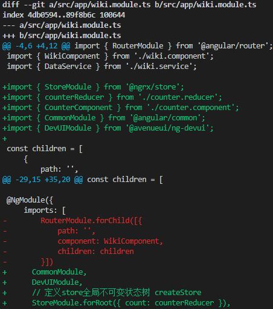
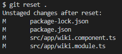
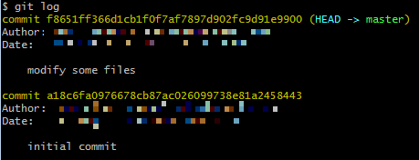
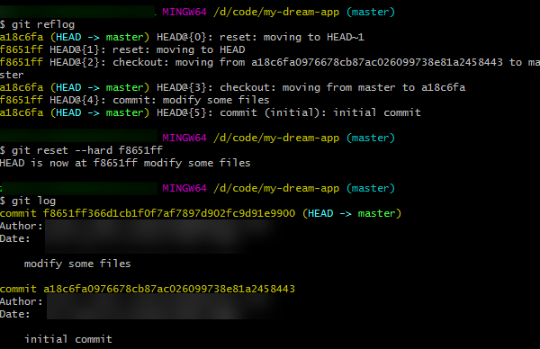
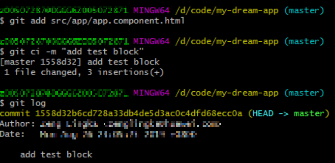
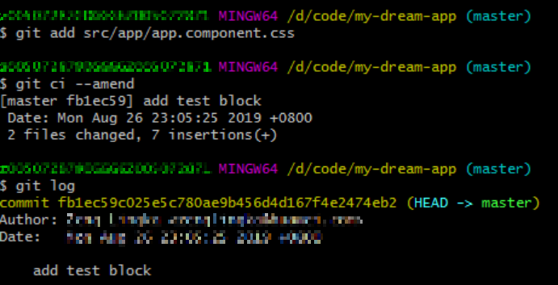
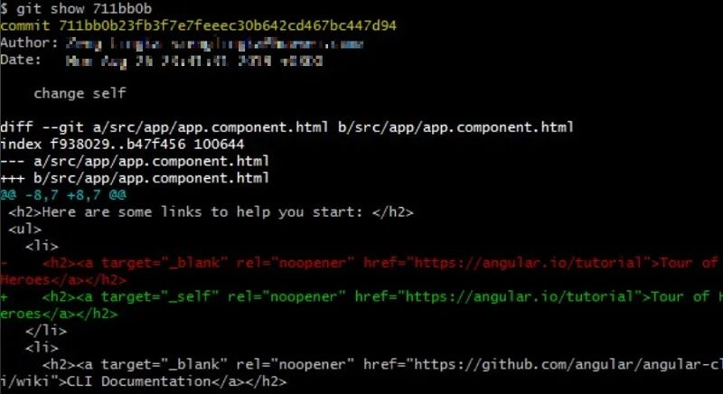
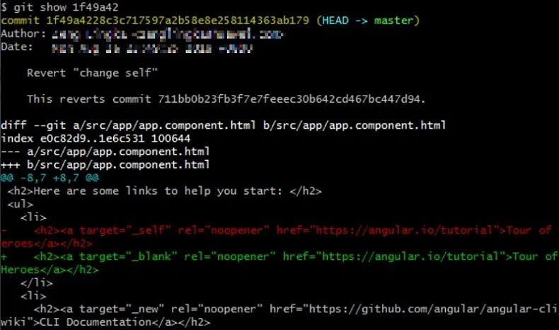
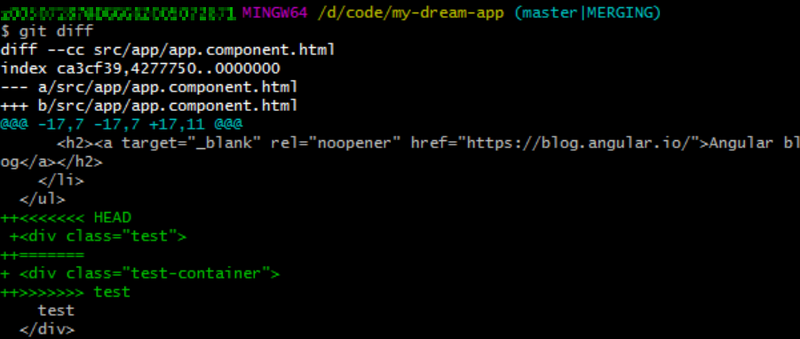

# Git的后悔补救

## 1.在未暂存前，撤销本地修改

在介绍Git“反悔”操作之前，先简单提及下Git的一些基础知识。
Git项目有3个区域：工作区、暂存区和Git仓库（分成本地仓库和远程仓库）。如下图：


本地编写的代码，不执行任何git命令，处于工作区。
* 执行**git add**命令时，会将工作区的文件标记为已暂存，保存在暂存区。
* 执行**git commit**命令时，会将标记为已暂存的文件保存都本地Git仓库，并生成一个快照。
* 在没有暂存之前（没有执行**git add**命令），我们可以通过以下命令查看本地修改：

``` sh
git diff
```

显示的格式如下图所示：


如果我们不想要这些代码本地代码（比如一些临时的测试代码），可以通过以下命令一次性撤销所有本地修改：

``` sh
git checkout -- .
```

> 注意：该命令不可二次“反悔”，本地操作一旦撤销，将无法通过Git找回。
> 撤销之后再次执行git diff命令将没有任何输出，代表没有文件在暂存区。
> 我们也可以指定具体的文件路径，撤销该文件的修改：

``` sh
git checkout -- [filename]
```

## 2.在暂存之后，撤销暂存区的修改

本地写完代码，提交到本地仓库之前，需要先将修改的文件添加到暂存区，执行以下命令将本地所有已修改的文件添加到暂存区（当然也可以指定具体的文件）：

``` sh
git add .
```

此时我们执行git diff命令，将不会有任何输出（因为文件已被添加到暂存区），想要查看暂存区的修改，可以执行以下命令：

``` sh
git diff --staged
```

看到的效果和之前为暂存前，通过git diff看到的一模一样。

如果这时我们想要一次性撤销暂存区的全部修改，可以执行以下命令（当然也可以撤销暂存区指定文件的修改）：

``` sh
git reset .
```



> 注意：该命令可以二次“反悔”，通过git add .命令可以将文件再一次添加到暂存区。
>这里的“撤销暂存区的修改”是指撤销git add .这个命令，回到执行git add .之前的状态，即已修改未暂存状态。
此时，如果执行git diff --staged命令，将没有任何输出，执行git diff命名将看到已修改未暂存状态的输出。
1和2的两个命令可以合并成一个：

``` sh
git reset --hard

<=>

git reset .
git checkout --
```

即：如果已暂存，但未提交本地仓库之前，想把所有文件直接抛弃（而不是从暂存区删除），可以直接执行以上命令。

## 3.提交到本地仓库之后（但未推送到远程仓库），撤销本次提交

执行以下命令，可以将暂存区的所有文件保存到本地Git仓库，并生成文件快照（便于之前的回退等操作）：

``` sh
git commit -m "modify some files"
```

此时提交历史里面会有一条记录f8651ff（Commit ID）：



如果我们不想要这次修改的内容，有以下2种方法：
方法一

回到当前提交的父对象a18c6fa（即上一次提交，通过**git log**查看），就等于撤销了本次提交：

``` sh
git checkout a18c6fa
```


执行git log命令，发现已经回到之前的提交：


方法二

重置之前的提交

``` sh
git reset --hard HEAD~1
```


效果和方法一一样：


注意：该命令是可以二次“反悔”的，具体步骤如下：

1. 找到被重置的提交 git reflog，发现是 f8651ff
2. 使用reset回到该提交 git reset --hard f8651ff



## 4.修改提交

考虑以下场景：

原本打算修改两个文件，结果只提交了一个文件，但又不想生成两个提交记录（Commit ID），具体执行的命令如下：

``` sh
git add src/app/app.component.html
git commit -m "add test block"
git log
```



这样其实只提交了**app.component.html**一个文件，不是我们想要的。

可以通过以下命令“反悔”（添加遗漏文件，又不重新生成新的Commit ID）：

``` sh
git add src/app/app.component.css
git commit --amend
```



还有一种场景可能更加常见，没有遗漏的文件，只是提交信息里有一个单词写错了，可以使用以下命令进行修补：

``` sh
git commit --amend -m "add test container"
```

> 注意：--amend修补参数会将改变之前的Commit ID，但不会生成新的Commit ID。

## 5.撤销提交历史中的某一次指定的提交

第3小结提到回退最近一次提交的方法（使用git reset命令），该方法只能针对连续的提交，如果只想撤销提交历史中的某一次提交（比如：），该怎么办呢？

比如：Commit ID为711bb0b的提交，该次提交将标签的target属性由"_blank"改成了"_self"。



可以使用以下命令撤销该次提交（将提交的内容“反操作”），并生成一个新的提交在最前面：

``` sh
git revert 711bb0b
```


revert之后，会在提交历史的最前面生成一个新的Commit ID（1f49a42），该次提交将标签的target属性由"_self"改回了"_blank"。



## 6.合并出现冲突时，撤销合并操作

两个分支改了同一个文件的同一个地方，合并时将出现冲突：




如果不想解决冲突，想撤销这个合并，可以使用以下命令：

``` sh
git merge --abort
```

abort之后，将恢复合并之前的状态。

## 7.暂存区的文件加多了，想移除，又不想删掉本地的文件

``` sh
git rm --cached src/test.pptx
```

## 8.分支重命名

``` sh
git br -m [old_br] [new_br]
```

## 9.撤销变基操作

将 rebase_test 分支的修改变基到master上：

``` sh
git co rebase_test
git rebase master
```


撤销的步骤如下：

1. 使用 git reflog 命令找到变基前的提交 09b0adc
2. 使用 git reset --hard 09b0adc 重置到该提交

## 10.以脚本方式改写提交

考虑以下场景，在一次很早的提交中，将一个储存密码的文件passwords.txt提交到了远程仓库，这时如果只是从远程仓库中删除该文件，别人依然可以通过提交历史找到这个文件。

因此我们需要从每一个快照中移除该密码文件，用以下命令就可以做到：

``` sh
git filter-branch --tree-filter 'rm -f passwords.txt' HEAD
```

该命令执行完会将提交历史中所有提交的passwords.txt文件彻底删除，永远没法通过Git找回。

除了以上“反悔”操作，还有一个很强大的命令，也可以以某种形式对过去做过的事情进行“反悔”，那就是交互式变基：

``` sh
git rebase -i
```
