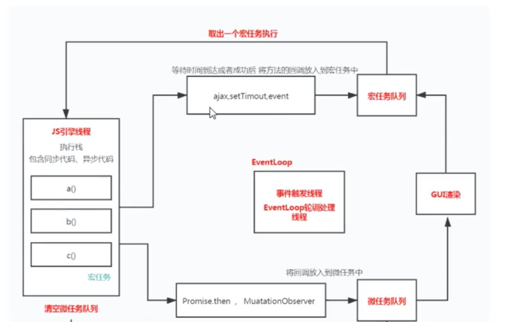

# 宏任务微任务

> 浏览器是多进程组成， tab进程、网络进程、协调进程
> 一个tab是一个进程， 有渲染线程、js引擎进程

- 宏任务(浏览器自带方法， 比如 **script**标签、**settimeout**、**click**等等)
- 微任务(语言实现的方法， 比如 **promise.then()**、**MuationObserver**)
  



整个script标签是一个宏任务,自上而下开始执行,遇到同步代码依次执行,宏任务会等到了合适时间放到宏任务队列中,**setTimeout()**是在到时间之后放到宏任务队列，**click**等点击之后放到宏任务队列，宏任务队列一次只执行第一个，其他等到下次轮询一次一个执行，微任务等宏任务执行完之后会直接依次清空微任务队列，然后是**GUI渲染**（可能不是每次都会重新渲染页面，然后继续回到宏任务队列，如果宏任务队列中有微任务，放到微任务队列，这样的过程就是**浏览器**的**evenloop**

贴上几道题

``` html
<!DOCTYPE html>
<html lang="en">
<head>
  <meta charset="UTF-8">
  <meta name="viewport" content="width=device-width, initial-scale=1.0">
  <meta http-equiv="X-UA-Compatible" content="ie=edge">
  <title>Document</title>
</head>
<body>
  <button id="btn">click</button>
</body>
<script>
  btn.addEventListener('click', () => {
    console.log('listener1');
    Promise.resolve().then(() => console.log('micro task1'));
  })
  btn.addEventListener('click', () => {
    console.log('listener2');
    Promise.resolve().then(() => console.log('micro task2'));
  })
  btn.click(); // click1() click2()
  // 注意，如果 btn.click() 直接执行，相当于同步执行代码，结果 listener1 listener2 task1 task2
  // 如果点击btn按钮执行，相当于宏任务中执行，一次只执行一个，结果 listener1 task1 listener2 task2
</script>
</html>
```
