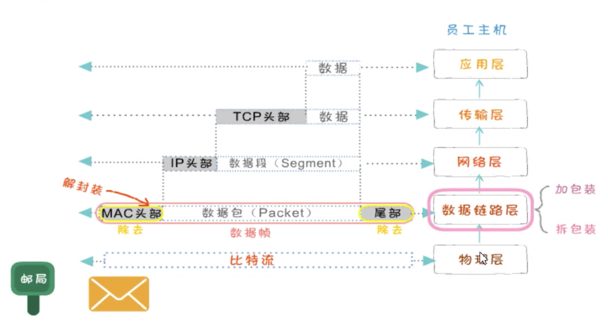
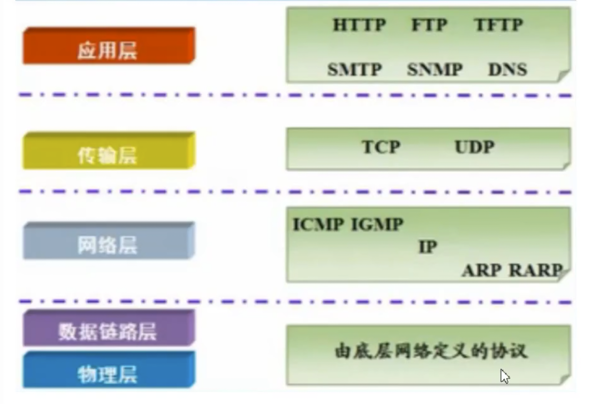

# 网络基础-1(OSI分层模型)

### OSI分层模型

分层|功能
-|:-:
应用层|网络服务与最终用户的一个接口
表示层|数据的表示、安全、压缩
会话层|建立、管理、终止会话
传输层|定义传输数据的协议端口号以及流控和差错校验
网络层|进行逻辑地址寻址，实现不同网络之间的路径选择
数据链路层|建立逻辑连接进行硬件地址寻址、差错校验(出错重传)
物理层|建立、维护、断开物理连接

### 封装过程

可以想象为寄送包裹的过程，先打包处理，到达后再进行拆解

### TCP/IP模型

TCP/IP 4层模型|TCP/IP 5层模型(常用)|OSI 7层模型(理想化)
-|:-:|:-
-|-|应用层
应用层|应用层|表示层
-|-|会话层
传输层|传输层|传输层
网络层|网络层|网络层
网络接口层|数据链路层|数据链路层
网络接口层|物理层|物理层

常用的四层模型中分别对应的常用协议

