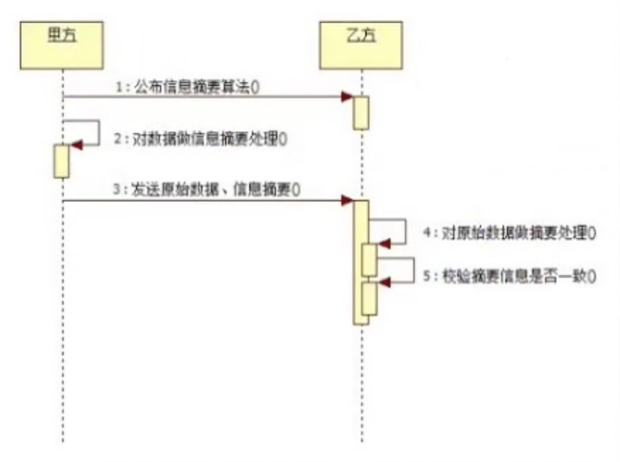
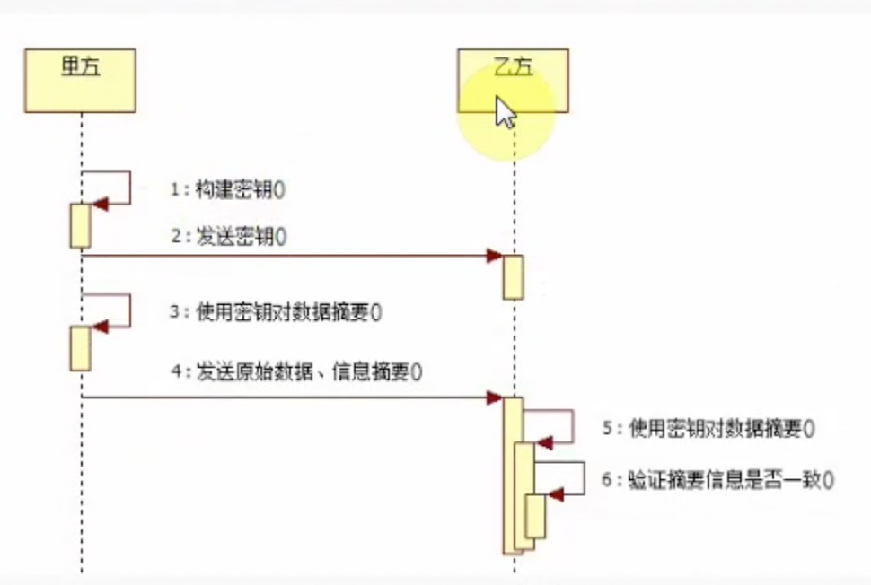
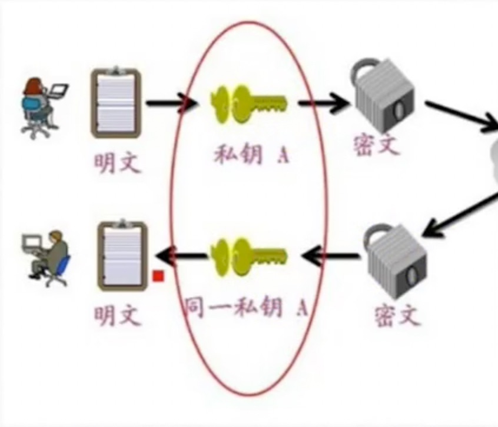

# 网络实战(加密解密)

## crpto

**crpto**是**node.js**中实现加密和解密的模块在**node.js**中，使用**OpenSSL**类库作为内部加密解密得手段**OpenSSL**是一个经过严格测试的可靠的加密与解密算法实现工具

## 散列(哈希)算法

散列算法也叫哈希算法，用来把任意长度的输入变换成固定长度的输出，常见的有md5，sha1等

- 相同的输入会产生相同的输出
- 不同的输入会产生不同的输出
- 任意的输入长度输入长度是相同的
- 不能从输出推算出输入的值



``` javascript
/**
 * 1.可以用来检验要下载的文件是否被改过
 * 2.对密码进行加密
 * */
const crypto = require('crypto');

let str = 'hello';
let md5 = crypto.createHash('md5');
md5.update('hello'); // 指定要加密的值
md5.update('world'); // 再次添加要加密的值
console.log(md5.digest('hex')); // 输出md5的值，指定输出的格式，hex 表示十六进制
// fc5e038d38a57032085441e7fe7010b0 32位
```

``` javascript
// 计算md5
const path = require('path');
let rs = require('fs').createReadStream(path.join(__dirname, 'name.txt'), {
    highWaterMark2
});
let md5 = crypto.createHash('md5');
rs.on('data', function (data) {
    md5.update(data); // update可以执行多次
});
rs.on('on', function (req, res) {
    const md5Val = md5.digest('hex');
    res.setHeader('Content-MD5', md5Val);
});
```

## HMAC算法

**HMAC算法**将散列算法与一个密钥结合在一起，以阻止对签名完整性的破坏



``` javascript
const hmac = crypto.createHmac(algorithm, key);
hmac.update(data);
```

- **algorithm**是一个可用的摘要算法，例如sha1、sha256
- **key**为一个字符串，用于指定一个**PEM**格式的密钥

生成私钥：**PEM**是**OpenSSL**的标准格式，**OpenSSL**使用**PEM**文件格式存储证书和密钥，是基于**Base64**编码的证书。

``` sh
openssl genrsa -out rsa_private.key 1024
```

``` javascript
const fs = require('fs');
const crypto = require('crypto');

const pem = fs.readFileSync(path.join(__dirname, './rsa_previte.key'));
const key = pem.toString('asccii');
const hmac = crypto.createHmac('sha1', key);
const rs = fs.createReadStream(path.join(__dirname, './1.txt'));
rs.on('data', function (data) {
    hmac.update(data);
});
rs.on('end', function () {
    let result = hmac.digest('hex');
    console.log('result', result);
});
```

## 对称加密

**blowfish**算法是一种对称的加密算法，对称的意思是加密和解密使用的是同一个秘钥。

> 缺点是第一次规定暗号时可能发生意外。



``` javascript
const crypto = require('crypto');
const fs = require('fs');

let str = 'hello';
let cipher = crypto.createCipher('bloefish', fs.readFileSync(path.join(__dirname, 'ras_private.key')));
cipher.update(str, 'utf8');
let encry = cipher.final('hex');
console.log('encry', encry);

let deciper = crypto.createDecipher('blowfish', fs.readFileSync(path.join(__dirname, 'ras_private.key')));
deciper.update(encry, 'hex');
let deEncry = deciper.final('utf8');
console.log('deEncry', deEncry);
```
