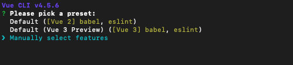
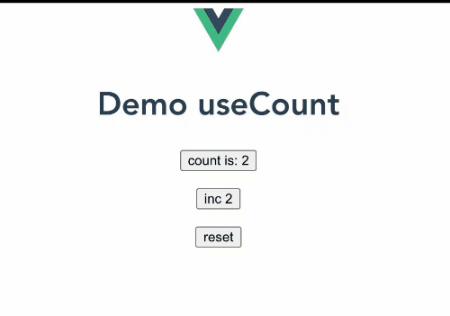
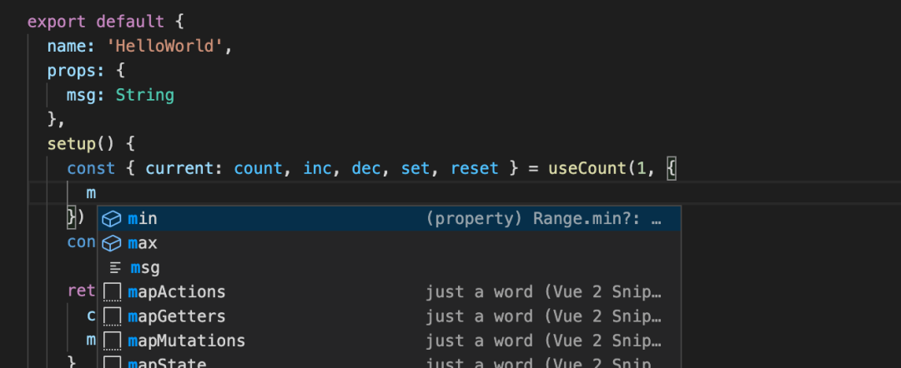
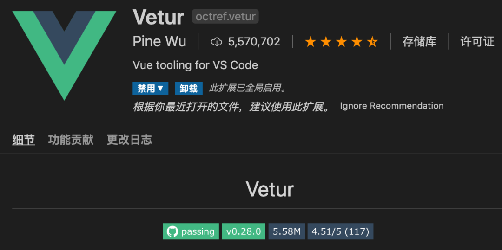

# Vue3+TypeScript 完整项目上手教程

## 一个完整的Vue3+Ts项目,支持.vue和.tsx写法

> 项目地址：https://github.com/vincentzyc/vue3-demo.git

TypeScript 是JS的一个超集，主要提供了类型系统和对ES6的支持，使用 TypeScript 可以增加代码的可读性和可维护性，在 react 和 vue 社区中也越来越多人开始使用TypeScript。从最近发布的 Vue3 正式版本来看， Vue3 的源码就是用 TypeScript 编写的，更好的 TypeScript 支持也是这一次升级的亮点。当然，在实际开发中如何正确拥抱 TypeScript 也是迁移至 Vue3 的一个小痛点，这里就针对 Vue3 和 TypeScript 展开一些交流。

Vue3入口: https://github.com/vuejs/vue-next

## 项目搭建

在官方仓库的 Quickstart 中推荐用两种方式方式来构建我们的 SPA 项目：

- vite

``` sh
npm init vite-app sail-vue3 # OR yarn create vite-app sail-vue3
```

- vue-cli

``` sh
npm install -g @vue/cli # OR yarn global add @vue/cli
vue create sail-vue3
# select vue 3 preset
```

vite 是一个由原生ESM驱动的Web开发构建工具，打开 vite 依赖的 package.json 可以发现在 devDependencies 开发依赖里面已经引入了TypeScript ，甚至还有 vuex , vue-router , less , sass 这些本地开发经常需要用到的工具。vite 轻量，开箱即用的特点，满足了大部分开发场景的需求，作为快速启动本地 Vue 项目来说，这是一个非常完美的工具。

> 后面的演示代码也是用vite搭的

从 vue2.x 走过来的掘友肯定知道 vue-cli 这个官方脚手架， vue3 的更新怎么能少得了 vue-cli 呢， vue-cli 更强调的是用 cli 的方式进行交互式的配置，选择起来更加灵活可控。丰富的官方插件适配，GUI的创建管理界面，标准化开发流程，这些都是 vue-cli 的特点。

- vue-cli ✖ TypeScript STEP1


- vue-cli ✖ TypeScript STEP2


> 想要预装TypeScript，就需要选择手动配置，并check好TypeScript

忘记使用选择 TypeScript 也没事，加一行cli命令就行了

``` sh
vue add typescript
```

最后，别忘了在 .vue 代码中，给 script 标签加上 lang="ts"

``` html
<script lang="ts">
```

## Option API风格

在 Vue2.x 使用过 TypeScript 的掘友肯定知道引入 TypeScript 不是一件简单的事情：

1. 要用 vue-class-component 强化 vue 组件，让 Script 支持 TypeScript 装饰器
2. 用 vue-property-decorator 来增加更多结合 Vue 特性的装饰器
3. 引入 ts-loader 让 webpack 识别 .ts .tsx 文件
.....

然后出来的代码风格是这样的：

``` javascript
@Component({
    components:{ componentA, componentB},
})
export default class Parent extends Vue{
  @Prop(Number) readonly propA!: number | undefined
  @Prop({ default: 'default value' }) readonly propB!: string
  @Prop([String, Boolean]) readonly propC!: string | boolean | undefined

  // data信息
  message = 'Vue2 code style'

  // 计算属性
  private get reversedMessage (): string[] {
      return this.message.split(' ').reverse().join('')
  }

  // method
  public changeMessage (): void {
    this.message = 'Good bye'
  }
}
```

class 风格的组件，各种装饰器穿插在代码中，有点感觉自己不是在写 vue ，些许凌乱🙈，所以这种曲线救国的方案在 vue3 里面肯定是行不通的。

在 vue3 中可以直接这么写：

``` javascript
import { defineComponent, PropType } from 'vue'

interface Student {
  name: string
  class: string
  age: number
}

const Component = defineComponent({
  props: {
    success: { type: String },
    callback: {
      type: Function as PropType<() => void>
    },
    student: {
      type: Object as PropType<Student>,
      required: true
    }
  },
  data() {
     return {
        message: 'Vue3 code style'
    }
  },
  computed: {
    reversedMessage(): string {
      return this.message.split(' ').reverse().join('')
    }
  }
})
```

vue 对 props 进行复杂类型验证的时候，就直接用 PropType 进行强制转换， data 中返回的数据也能在不显式定义类型的时候推断出大多类型， computed 也只用返回类型的计算属性即可，代码清晰，逻辑简单，同时也保证了 vue 结构的完整性。

## Composition API风格

在 vue3 的 Composition API 代码风格中，比较有代表性的api就是 ref 和 reactive ，我们看看这两个是如何做类型声明的：

### ref

``` javascript
import { defineComponent, ref } from 'vue'

const Component = defineComponent({
setup() {
  const year = ref(2020)
  const month = ref<string | number>('9')

  month.value = 9 // OK
  const result = year.value.split('') // => Property 'split' does not exist on type 'number'
 }
})
```

分析上面的代码，可以发现如果我们不给定 ref 定义的类型的话， vue3 也能根据初始值来进行类型推导，然后需要指定复杂类型的时候简单传递一个泛型即可。

> Tips：如果只有setup方法的话，可以直接在defineComponent中传入setup函数

``` javascript
const Component = defineComponent(() => {
    const year = ref(2020)
    const month = ref<string | number>('9')

    month.value = 9 // OK
    const result = year.value.split('') // => Property 'split' does not exist on type 'number'
})
```

### reactive

``` javascript
import { defineComponent, reactive } from 'vue'

interface Student {
  name: string
  class?: string
  age: number
}

export default defineComponent({
  name: 'HelloWorld',
  setup() {
    const student = reactive<Student>({ name: '阿勇', age: 16 })
    // or
    const student: Student = reactive({ name: '阿勇', age: 16 })
    // or
    const student = reactive({ name: '阿勇', age: 16, class: 'cs' }) as Student
  }
})
```

声明 reactive 的时候就很推荐使用接口了，然后怎么使用类型断言就有很多种选择了，这是TypeScript 的语法糖，本质上都是一样的。

## 自定义Hooks

vue3 借鉴 react hooks 开发出了 Composition API ，那么也就意味着 Composition API也能进行自定义封装 hooks ，接下来我们就用 TypeScript 风格封装一个计数器逻辑的 hooks （ useCount ）:

首先来看看这个 hooks 怎么使用：

``` javascript
import { ref } from '/@modules/vue'
import  useCount from './useCount'

export default {
  name: 'CountDemo',
  props: {
    msg: String
  },
  setup() {
    const { current: count, inc, dec, set, reset } = useCount(2, {
      min: 1,
      max: 15
    })
    const msg = ref('Demo useCount')

    return {
      count,
      inc,
      dec,
      set,
      reset,
      msg
    }
  }
}
```

出来的效果就是：



贴上 useCount 的源码：

``` javascript
import { ref, Ref, watch } from 'vue'

interface Range {
  min?: number,
  max?: number
}

interface Result {
  current: Ref<number>,
  inc: (delta?: number) => void,
  dec: (delta?: number) => void,
  set: (value: number) => void,
  reset: () => void
}

export default function useCount(initialVal: number, range?: Range): Result {
  const current = ref(initialVal)
  const inc = (delta?: number): void => {
    if (typeof delta === 'number') {
      current.value += delta
    } else {
      current.value += 1
    }
  }
  const dec = (delta?: number): void => {
    if (typeof delta === 'number') {
      current.value -= delta
    } else {
      current.value -= 1
    }
  }
  const set = (value: number): void => {
    current.value = value
  }
  const reset = () => {
    current.value = initialVal
  }

  watch(current, (newVal: number, oldVal: number) => {
    if (newVal === oldVal) return
    if (range && range.min && newVal < range.min) {
      current.value = range.min
    } else if (range && range.max && newVal > range.max) {
      current.value = range.max
    }
  })

  return {
    current,
    inc,
    dec,
    set,
    reset
  }
}
```

分析源码

这里首先是对 hooks 函数的入参类型和返回类型进行了定义，入参的 Range 和返回的 Result 分别用一个接口来指定，这样做了以后，最大的好处就是在使用 useCount 函数的时候，ide就会自动提示哪些参数是必填项，各个参数的类型是什么，防止业务逻辑出错。



接下来，在增加 inc 和减少 dec 的两个函数中增加了 typeo 类型守卫检查，因为传入的 delta 类型值在某些特定场景下不是很确定，比如在 template 中调用方法的话，类型检查可能会失效，传入的类型就是一个原生的 Event 。

关于 ref 类型值，这里并没有特别声明类型，因为 vue3 会进行自动类型推导，但如果是复杂类型的话可以采用类型断言的方式：ref(initObj) as Ref<ObjType>

## 小建议

### AnyScript

在初期使用 TypeScript 的时候，很多掘友都很喜欢使用 any 类型，硬生生把TypeScript写成了 AnyScript ，虽然使用起来很方便，但是这就失去了 TypeScript 的类型检查意义了，当然写类型的习惯是需要慢慢去养成的，不用急于一时。

### Vetur

vetur 代码检查工具在写vue代码的时候会非常有用，就像构建 vue 项目少不了 vue-cli一样，vetur 提供了 vscode 的插件支持，赶着升级 vue3 这一波工作，顺带也把 vetur也带上吧。



## 一个完整的Vue3+ts项目

``` md
├─public
│      favicon.ico
│      index.html
└─src
    │  App.vue
    │  main.ts
    │  shims-vue.d.ts
    ├─assets
    │  │  logo.png
    │  └─css
    │          base.css
    │          main.styl
    ├─components
    │  │  HelloWorld.vue
    │  └─base
    │          Button.vue
    │          index.ts
    │          Select.vue
    ├─directive
    │      focus.ts
    │      index.ts
    │      pin.ts
    ├─router
    │      index.ts
    ├─store
    │      index.ts
    ├─utils
    │  │  cookie.ts
    │  │  deep-clone.ts
    │  │  index.ts
    │  │  storage.ts
    │  └─validate
    │          date.ts
    │          email.ts
    │          mobile.ts
    │          number.ts
    │          system.ts
    └─views
        │  About.vue
        │  Home.vue
        │  LuckDraw.vue
        │  TodoList.vue
        └─address
                AddressEdit.tsx
                AddressList.tsx
```

### .vue写法

``` html
<template>
  ...
</template>

<script lang="ts">
import dayjs from "dayjs";
import { ref, reactive, onMounted } from "vue";
import { Button, Step, Steps, NoticeBar } from "vant";

export default {
  components: {
    Button,
    Step,
    Steps,
    NoticeBar,
  },
  setup() {
    const nameinput = ref();
    const selectionStart = ref(0);
    const twoNow = dayjs().subtract(2, "day").format("YYYY-MM-DD HH:mm:ss");
    const now = dayjs().format("YYYY-MM-DD HH:mm:ss");
    const now2 = dayjs().add(2, "day").format("YYYY-MM-DD HH:mm:ss");
    const formData = reactive({
      name: "",
      phone: "",
      code: "",
    });

    onMounted(() => {
      (nameinput.value as HTMLInputElement).focus();
    });

    const insertName = () => {
      const index = (nameinput.value as HTMLInputElement).selectionStart;
      if (typeof index !== "number") return;
      formData.name =
        formData.name.slice(0, index) + "哈哈" + formData.name.slice(index);
    };

    return {
      nameinput,
      formData,
      insertName,
      selectionStart,
      twoNow,
      now,
      now2,
    };
  },
};
</script>
```

``` html
<template>
   ...
</template>

<script lang="ts">
import dayjs from "dayjs";
import { defineComponent } from "vue";
import HelloWorld from "@/components/HelloWorld.vue"; // @ is an alias to /src
import { Button, Dialog, Toast } from "vant";

export default defineComponent({
  name: "Home",
  components: {
    HelloWorld,
    Button,
  },
  data() {
    return {
      direction: "top",
      pinPadding: 0,
      time: "",
      timer: 0,
      color: "red",
    };
  },
  methods: {
    showToast() {
      Toast("字体颜色已改蓝色");
      this.color = "blue";
    },
    handleClick() {
      Dialog({
        title: "标题",
        message: "这是一个全局按钮组件",
      });
    },
    initTime() {
      this.time = dayjs().format("YYYY-MM-DD HH:mm:ss");
      this.timer = setInterval(() => {
        this.time = dayjs().format("YYYY-MM-DD HH:mm:ss");
      }, 1000);
    },
  },
  created() {
    this.initTime();
  },
  beforeUnmount() {
    clearInterval(this.timer);
  },
});
</script>

<style vars="{ color }">
.text-color {
  color: var(--color);
}
</style>
```

### tsx写法

``` javascript
import { ref, reactive } from "vue";
import { AddressList, NavBar, Toast, Popup } from "vant";
import AddressEdit from './AddressEdit'
import router from '@/router'

export default {
  setup() {
    const chosenAddressId = ref('1')
    const showEdit = ref(false)

    const list = reactive([
      {
        id: '1',
        name: '张三',
        tel: '13000000000',
        address: '浙江省杭州市西湖区文三路 138 号东方通信大厦 7 楼 501 室',
        isDefault: true,
      },
      {
        id: '2',
        name: '李四',
        tel: '1310000000',
        address: '浙江省杭州市拱墅区莫干山路 50 号',
      },
    ])
    const disabledList = reactive([
      {
        id: '3',
        name: '王五',
        tel: '1320000000',
        address: '浙江省杭州市滨江区江南大道 15 号',
      },
    ])

    const onAdd = () => {
      showEdit.value = true
    }
    const onEdit = (item: any, index: string) => {
      Toast('编辑地址:' + index);
    }

    const onClickLeft = () => {
      router.back()
    }

    const onClickRight = () => {
      router.push('/todoList')
    }

    return () => {
      return (
        <div style="background:#f7f8fa">
          <NavBar
            title="地址管理"
            left-text="返回"
            right-text="Todo"
            left-arrow
            onClick-left={onClickLeft}
            onClick-right={onClickRight}
          />
          <AddressList
            vModel={chosenAddressId.value}
            list={list}
            disabledList={disabledList}
            disabledText="以下地址超出配送范围"
            defaultTagText="默认"
            onAdd={onAdd}
            onEdit={onEdit}
          />
          <Popup vModel={[showEdit.value, 'show']} position="bottom" round style="height: 80%" >
            <AddressEdit />
          </Popup>
        </div >
      );
    };
  }
};
```
