# Nginx基础配置

## 1.Nginx知识网结构图

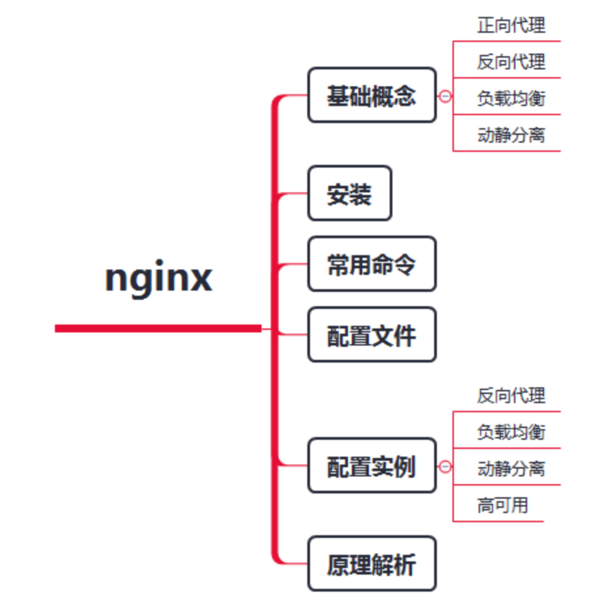

Nginx是一个高性能的HTTP和反向代理服务器，特点是占用内存少，并发能力强，事实上nginx的并发能力确实在同类型的网页服务器中表现较好

nginx专为性能优化而开发，性能是其最重要的要求，十分注重效率，有报告nginx能支持高达50000个并发连接数

### 1.1反向代理

#### 正向代理

正向代理：局域网中的电脑用户想要直接访问网络是不可行的，只能通过代理服务器来访问，这种代理服务就被称为正向代理。

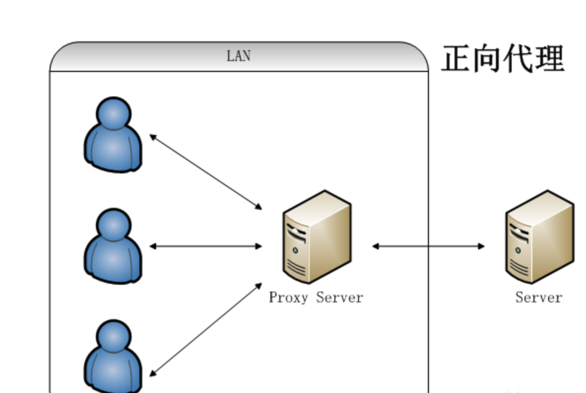

#### 反向代理

反向代理：客户端无法感知代理，因为客户端访问网络不需要配置，只要把请求发送到反向代理服务器，由反向代理服务器去选择目标服务器获取数据，然后再返回到客户端，此时反向代理服务器和目标服务器对外就是一个服务器，暴露的是代理服务器地址，隐藏了真实服务器IP地址

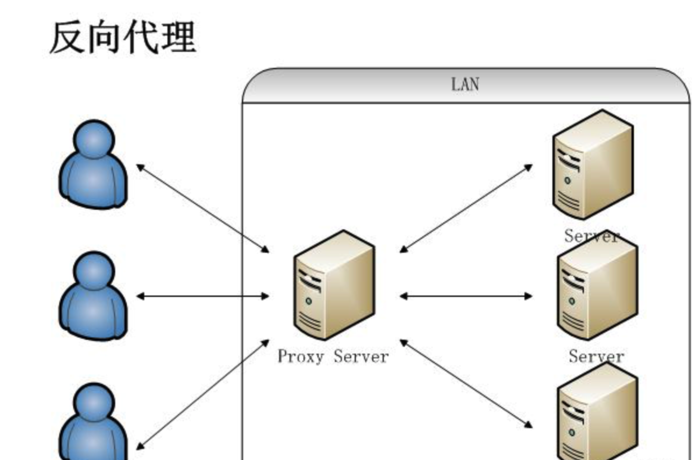

### 1.2负载均衡

客户端发送多个请求到服务器，服务器处理请求，有一些可能要与数据库进行狡猾，服务器处理完毕之后，再将结果返回给客户端

普通请求和响应过程


但是随着信息数量增长，访问量和数据量飞速增长，普通架构无法满足现在的需求

我们首先想到的是升级服务器配置，可以由于摩尔定律的日益失效，单纯从硬件提升性能已经逐渐不可取了，怎么解决这种需求呢？

我们可以增加服务器的数量，构建集群，将请求分发到各个服务器上，将原来请求集中到单个服务器的情况改为请求分发到多个服务器，也就是我们说的负载均衡

图解负载均衡

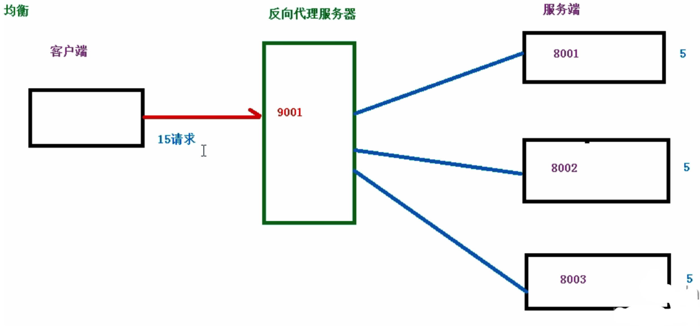

### 1.3动静分离

为了加快网站的解析速度，可以把动态页面和静态页面交给不同的服务器来解析，加快解析的速度，降低由单个服务器的压力


## 2. nginx如何在linux安装

https://blog.csdn.net/yujing1314/article/details/97267369

## 3. nginx常用命令

查看版本

``` sh
./nginx -v
```

启动

``` sh
./nginx
```

关闭（有两种方式，推荐使用 ./nginx -s quit）

``` sh
 ./nginx -s stop
 ./nginx -s quit
```

重新加载nginx配置

``` sh
./nginx -s reload
```

## 4.nginx的配置文件

配置文件分三部分组成

### 全局块

从配置文件开始到events块之间，主要是设置一些影响nginx服务器整体运行的配置指令

并发处理服务的配置，值越大，可以支持的并发处理量越多，但是会受到硬件、软件等设备的制约

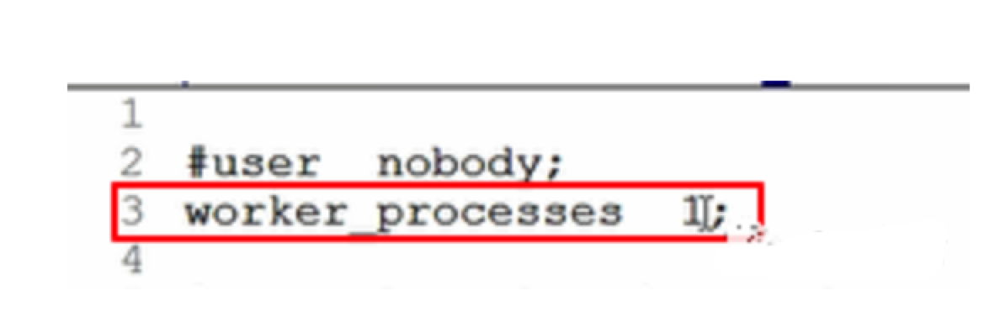

### events块

影响nginx服务器与用户的网络连接，常用的设置包括是否开启对多workprocess下的网络连接进行序列化，是否允许同时接收多个网络连接等等

支持的最大连接数

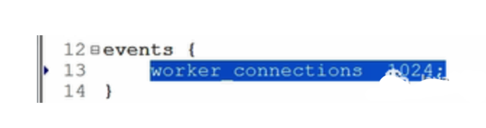

### http块

诸如反向代理和负载均衡都在此配置

location指令说明

该语法用来匹配url，语法如下

``` sh
location[ = | ~ | ~* | ^~] url{

}
```

1. =:用于不含正则表达式的url前，要求字符串与url严格匹配，匹配成功就停止向下搜索并处理请求
2. ~：用于表示url包含正则表达式，并且区分大小写。
3. ~*：用于表示url包含正则表达式，并且不区分大瞎写
4. ^~：用于不含正则表达式的url前，要求ngin服务器找到表示url和字符串匹配度最高的location后，立即使用此location处理请求，而不再匹配
5. 如果有url包含正则表达式，不需要有~开头标识

### 4.1 反向代理实战

#### 配置反向代理

目的：在浏览器地址栏输入地址http://www.123.com跳转linux系统tomcat主页面

#### 具体实现

先配置tomcat：因为比较简单，此处不再赘叙

并在windows访问

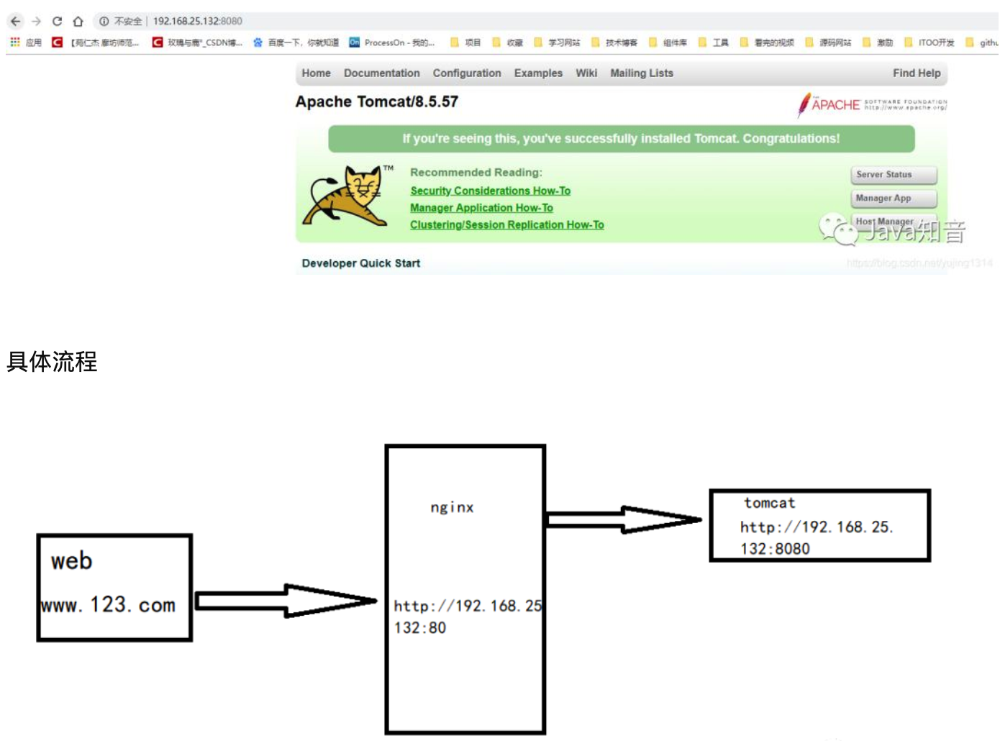
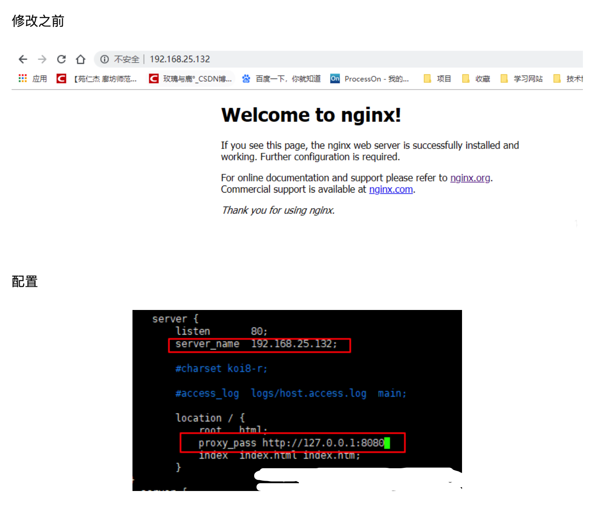
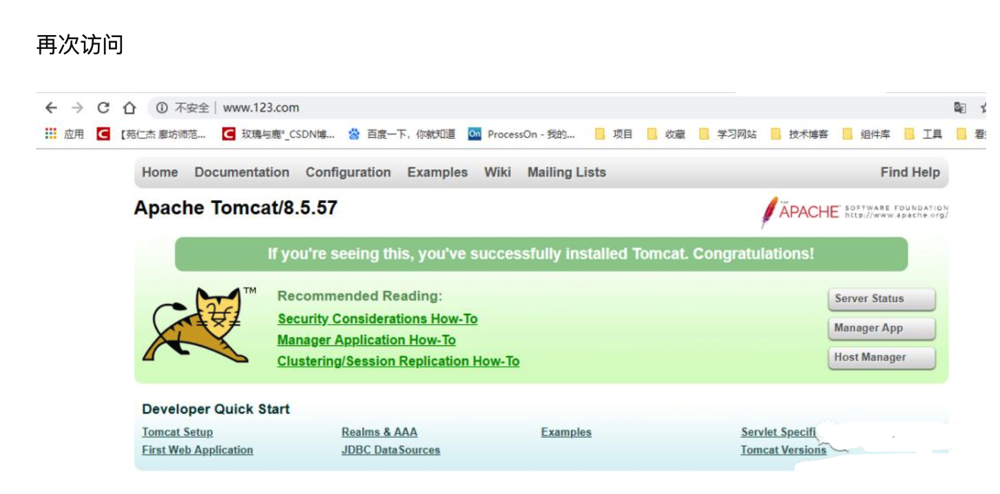

#### 反向代理2

##### 1.目标

访问http://192.168.25.132:9001/edu/ 直接跳转到192.168.25.132:8080
访问http://192.168.25.132:9001/vod/ 直接跳转到192.168.25.132:8081

##### 2.准备

配置两个tomcat，端口分别为8080和8081，都可以访问，端口修改配置文件即可。


响应如下

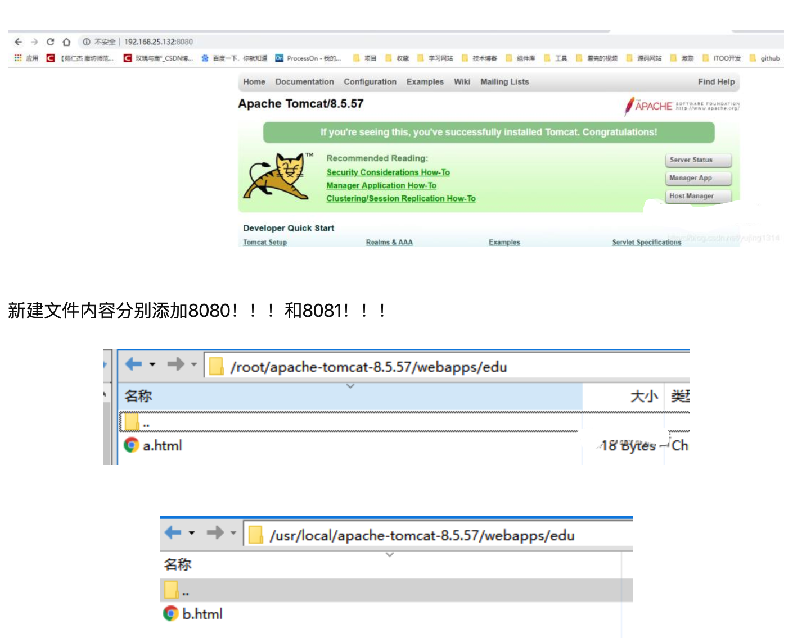
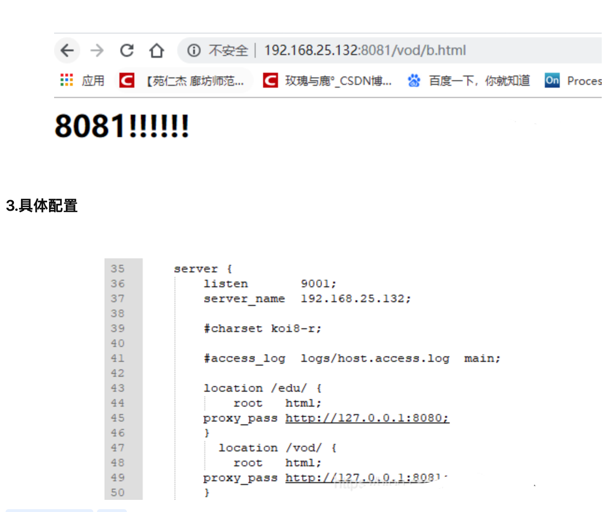
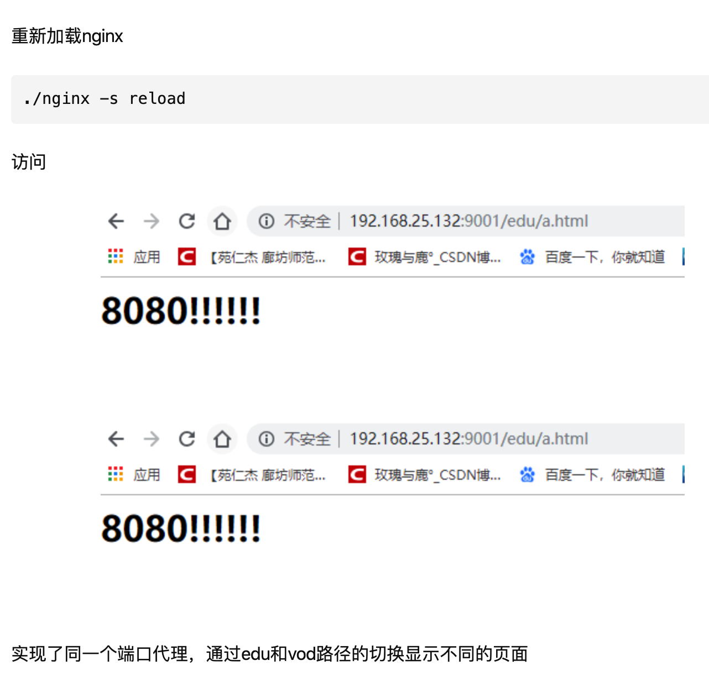

实现了同一个端口代理，通过edu和vod路径的切换显示不同的页面

### 4.2 反向代理小结

#### 第一个例子：

浏览器访问http://www.123.com，由host文件解析出服务器ip地址

192.168.25.132 http://www.123.com

然后默认访问80端口，而通过nginx监听80端口代理到本地的8080端口上，从而实现了访问http://www.123.com，最终转发到tomcat 8080上去

#### 第二个例子：

访问http://192.168.25.132:9001/edu/ 直接跳转到192.168.25.132:8080
访问http://192.168.25.132:9001/vod/ 直接跳转到192.168.25.132:8081

实际上就是通过nginx监听9001端口，然后通过正则表达式选择转发到8080还是8081的tomcat上去

### 4.3 负载均衡实战

#### 1.修改nginx.conf

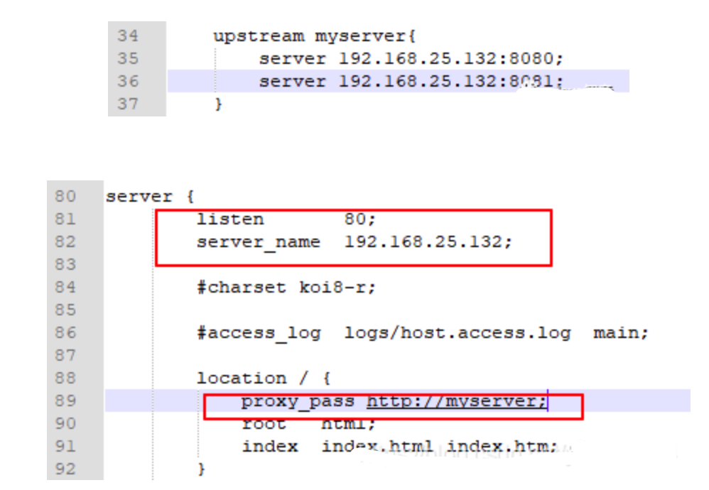

#### 2.重启nginx

``` sh
./nginx -s reload
```

#### 3.在8081的tomcat的webapps文件夹下新建edu文件夹和a.html文件，填写内容为8081

#### 4.在地址栏回车，就会分发到不同的tomcat服务器上


#### 5.负载均衡方式

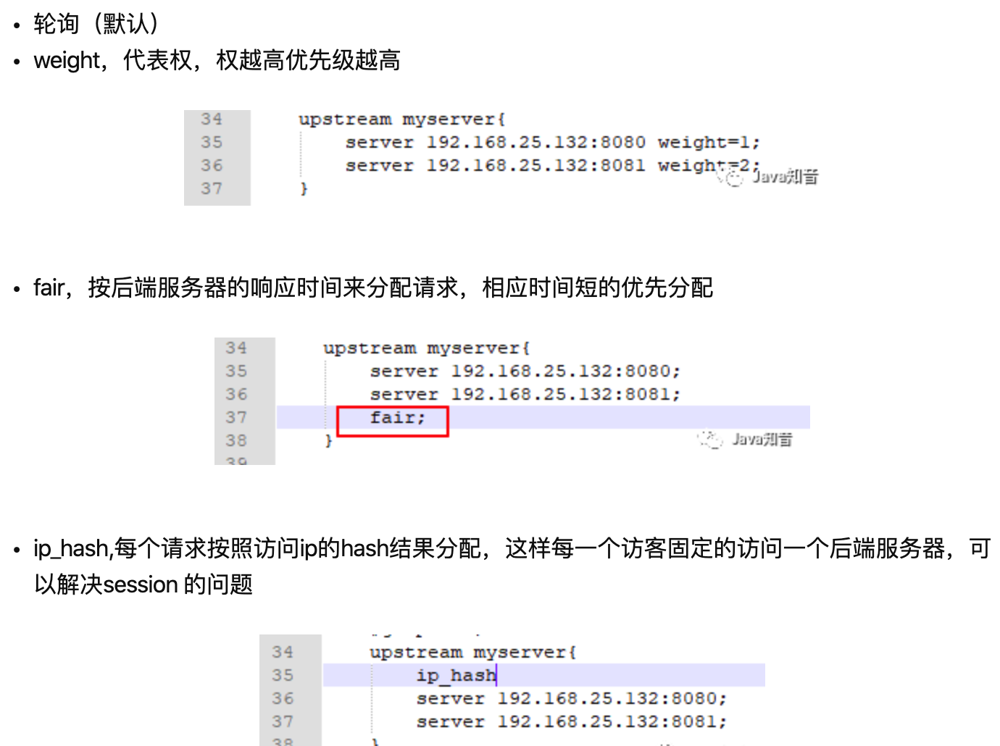

### 4.4 动静分离实战

#### 什么是动静分离

把动态请求和静态请求分开，不是讲动态页面和静态页面物理分离，可以理解为nginx处理静态页面，tomcat处理动态页面

#### 动静分离大致分为两种：

##### 一、纯粹将静态文件独立成单独域名放在独立的服务器上，也是目前主流方案；

##### 二、将动态跟静态文件混合在一起发布，通过nginx分开

#### 动静分离图析


#### 实战准备

准备静态文件

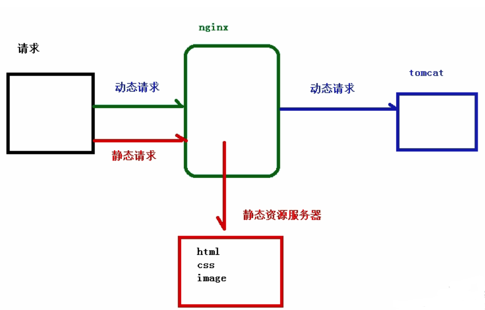


#### 配置nginx

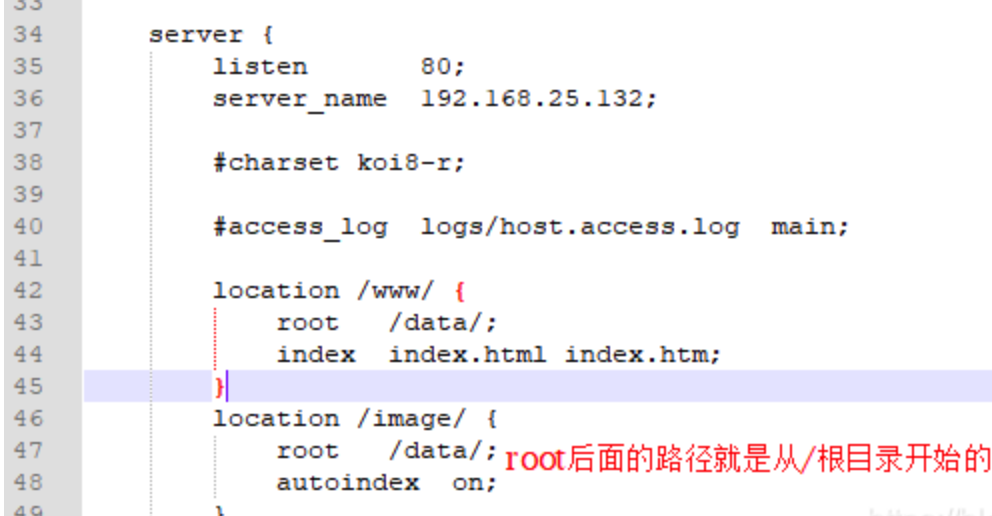

## 5.nginx高可用

如果nginx出现问题

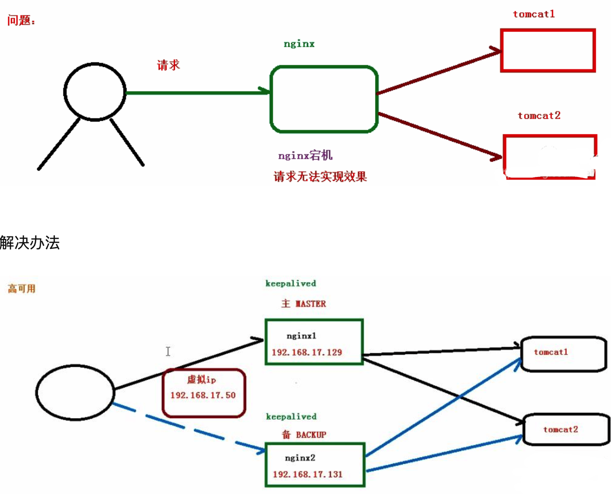

### 前期准备

1. 两台nginx服务器
2. 安装keepalived
3. 虚拟ip

### 5.1安装keepalived

``` sh
[root@192 usr]# yum install keepalived -y
[root@192 usr]# rpm -q -a keepalived
keepalived-1.3.5-16.el7.x86_64
```

#### 修改配置文件

``` sh
[root@192 keepalived]# cd /etc/keepalived
[root@192 keepalived]# vi keepalived.conf 
```

分别将如下配置文件复制粘贴，覆盖掉keepalived.conf

虚拟ip为192.168.25.50

对应主机ip需要修改的是

``` sh
smtp_server 192.168.25.147（主）smtp_server 192.168.25.147（备）
state MASTER（主） state BACKUP（备）
global_defs {
   notification_email {
     acassen@firewall.loc
     failover@firewall.loc
     sysadmin@firewall.loc
   }
   notification_email_from Alexandre.Cassen@firewall.loc
   smtp_server 192.168.25.147
   smtp_connect_timeout 30
   router_id LVS_DEVEL # 访问的主机地址
}

vrrp_script chk_nginx {
  script "/usr/local/src/nginx_check.sh"  # 检测文件的地址
  interval 2   # 检测脚本执行的间隔
  weight 2   # 权重
}

vrrp_instance VI_1 {
    state BACKUP    # 主机MASTER、备机BACKUP    
    interface ens33   # 网卡
    virtual_router_id 51 # 同一组需一致
    priority 90  # 访问优先级，主机值较大，备机较小
    advert_int 1
    authentication {
        auth_type PASS
        auth_pass 1111
    }
    virtual_ipaddress {
        192.168.25.50  # 虚拟ip
    }
}
```

启动

``` sh
[root@192 sbin]# systemctl start keepalived.service
```

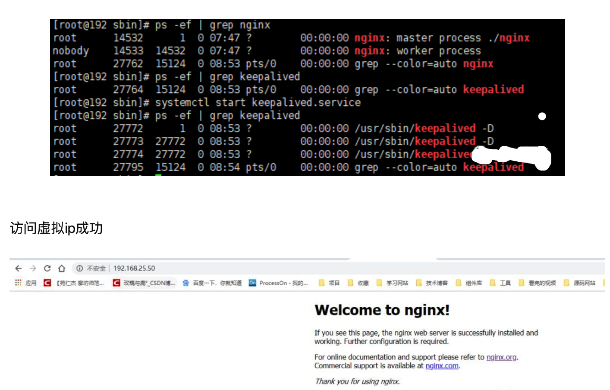

关闭主机147的nginx和keepalived，发现仍然可以访问

## 6.原理解析

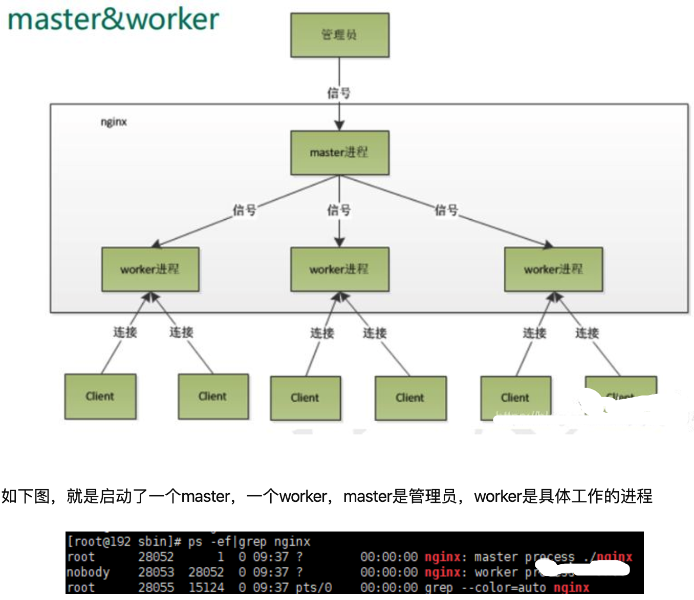
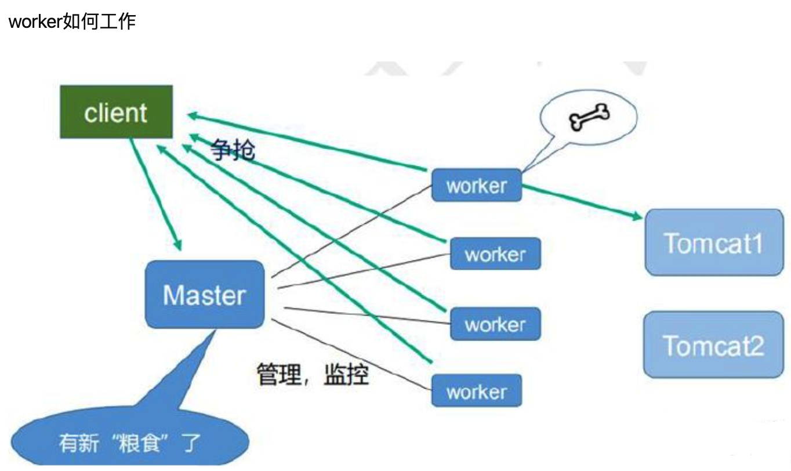

## 小结

- worker数应该和CPU数相等
- 一个master多个worker可以使用热部署，同时worker是独立的，一个挂了不会影响其他的
