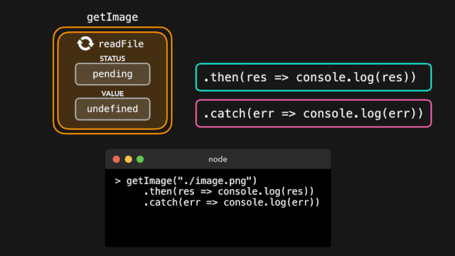
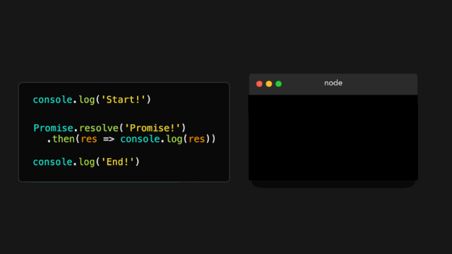
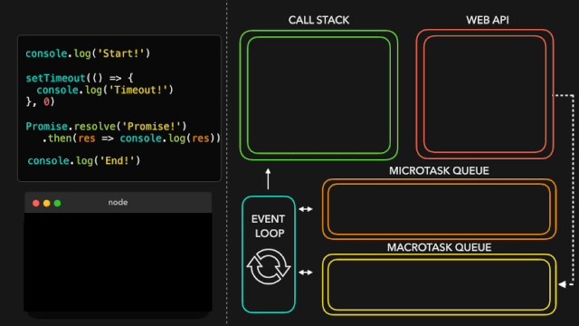

# 动态图演示 Promises & Async/Await 的过程

## 介绍

在书写 JavaScript 的时候，我们经常不得不去处理一些依赖于其它任务的任务！

比如：我们想要得到一个图片，对其进行压缩，应用一个滤镜，然后保存它 。

首先，先用 getImage 函数要得到我们想要编辑的图片。

一旦图片被成功加载，把这个图片值传到一个 ocmpressImage 函数中。

当图片已经被成功地重新调整大小后，在 applyFilter 函数中为图片应用一个滤镜。

在图片被压缩和添加滤镜后，保存图片并且打印成功的日志！

最后，代码很简单如图：

注意到了吗？尽管以上代码也能得到我们想要的结果，但是完成的过程并不是友好。

使用了大量嵌套的回调函数，这使我们的代码阅读起来特别困难。

因为写了许多嵌套的回调函数，这些回调函数又依赖于前一个回调函数，这通常被称为 回调地狱。

幸运的，ES6 中的 Promise 的能很好的处理这种情况！

让我们看看 promise 是什么，以及它是如何在类似于上述的情况下帮助我们的。

## Promise语法

ES6引入了Promise。在许多教程中，你可能会读到这样的内容：

> Promise 是一个值的占位符，这个值在未来的某个时间要么 resolve 要么 reject 。
对于我来说，这样的解释从没有让事情变得更清楚。

事实上，它只是让我感觉 Promise 是一个奇怪的、模糊的、不可预测的一段魔法。

接下来让我们看看 promise 真正是什么？

我们可以使用一个接收一个回调函数的 Promise 构造器创建一个 promise。

等等，刚刚得到的返回值是什么？

Promise 是一个对象，它包含一个状态 PromiseStatus 和一个值 PromiseValue。

在上面的例子中，你可以看到 PromiseStatus  的值是 pending, PromiseValue 的值是 undefined。

不过 - 你将永远不会与这个对象进行交互，你甚至不能访问 PromiseStatus 和  PromiseValue 这两个属性！

然而，在使用 Promise 的时候，这俩个属性的值是非常重要的。

### PromiseStatus 的值，也就是 Promise 的状态，可以是以下三个值之一：

1. ✅ fulfilled: promise 已经被 resolved。一切都很好，在 promise 内部没有错误发生。

2. ❌ rejected: promise 已经被 rejected。某些事情出错了。

3. ⏳ pending: promise 暂时还没有被解决也没有被拒绝，仍然处于 pending 状态

好吧，这一切听起来很棒，但是什么时候 promise 的状态是 pending、fulfilled 或 rejected 呢?  为什么这个状态很重要呢？

在上面的例子中，我们只是为 Promise构造器传递了一个简单的回调函数 () => {} 。

然而，这个回调函数实际上接受两个参数。

- 第一个参数的值经常被叫做 resolve 或 res，它是一个函数，在 Promise 应该解决 resolve 的时候会被调用。
- 第二个参数的值经常被叫做 reject 或rej，它也是一个函数，在 Promise 出现一些错误应该被拒绝 reject 的时候被调用。

让我们尝试看看当我们调用 resolve 或 reject 方法时得到的日志。

在我的例子中，把 resolve 方法叫做 res，把  reject 方法叫做 rej。

我们终于知道如何摆脱 pending 状态和 undefined 值了！

当我们调用 resolve 方法时，promise 的状态是 fulfilled。

当我们调用 reject 方法时，promise 的状态是 rejected。

Promise 可以解决混乱的嵌套回调问题。

首先，让我们重写整个代码块，以便每个函数返回一个 Promise 来代替之前的函数。

如果图片被加载完成并且一切正常，让我们用加载完的图片解决 (resolve)promise。

否则，如果在加载文件时某个地方有一个错误，我们将会用发生的错误拒绝 (reject)promise 。

现在，我们不关心整个 promise 对象，我们只关心数据的值！幸运的，有内置的方法来得到 promise 的值。

对于一个 promise，我们可以使用它上面的 3 个方法：

- .then(): 在一个 promise 被 resolved 后调用
- .catch(): 在一个 promise 被 rejected 后被调用
- .finally(): 不论 promise 是被 resolved 还是 reject 总是调用

.then 方法接收传递给 resolve 方法的值。

.catch 方法接收传递给 rejected 方法的值。

最终，我们拥有了 promise 被解决后 (resolved) 的值，并不需要整个 promise 对象！

现在我们可以用这个值做任何我们想做的事。

顺便提醒一下，当你知道一个 promise 总是 resolve 或者总是 reject 的时候，你可以写 Promise.resolve 或 Promise.reject，传入你想要 reject 或 resolve 的 promise 的值。

在下边的例子中你将会经常看到这个语法。

在 getImage 的例子中，为了运行它们，我们最终不得不嵌套多个回调。幸运的，.then 处理器可以帮助我们完成这件事！

.then 它自己的执行结果是一个 promise。这意味着我们可以链接任意数量的 .then：前一个 then 回调的结果将会作为参数传递给下一个 then 回调！

在 getImage 示例中，为了传递被处理的图片到下一个函数，我们可以链接多个 then 回调。

相比于之前最终得到许多嵌套回调，现在我们得到了整洁的 then 链。

完美！这个语法看起来已经比之前的嵌套回调好多了。

### 宏任务和微任务(macrotask and microtask)

我们知道了一些如何创建 promise 以及如何提取出 promise 的值的方法。

让我们为脚本添加一些更多的代码并且再次运行它：

首先，Start! 被输出。

好的，我们已经看到了那一个即将到来的消息：console.log('Start!') 在最前一行输出！

然而，第二个被打印的值是 End!，并不是 promise 被解决的值！只有在 End! 被打印之后，promise 的值才会被打印。

这里发生了什么？

我们最终看到了 promise 真正的力量！尽管 JavaScript 是单线程的，我们可以使用 Promise 添加异步任务！

等等，我们之前没见过这种情况吗？

在 JavaScript  Event Loop 中，我们不是也可以使用浏览器原生的方法如 setTimeout 创建某类异步行为吗？

是的！然而，在事件循环内部，实际上有 2 种类型的队列：宏任务(macro)队列 (或者只是叫做 任务队列 )和 微任务队列。

(宏)任务队列用于 宏任务，微任务队列用于 微任务。

那么什么是宏任务，什么是微任务呢？

尽管他们比我在这里介绍的要多一些，但是最常用的已经被展示在下面的表格中！

- (Macro)task setTimeout setInterval setImmediate
- (Micro)task process.nextTick Promise callback queueMicrotask

我们看到 Promise 在微任务列表中！当一个 Promise 解决 (resolve) 并且调用它的 then()、catch() 或 finally() 方法的时候，这些方法里的回调函数被添加到微任务队列！

这意味着 then()，chatch() 或 finally() 方法内的回调函数不是立即被执行，本质上是为我们的 JavaScript 代码添加了一些异步行为！

那么什么时候执行 then()，catch()，或 finally() 内的回调呢？

事件循环给与任务不同的优先级：

1. 当前在调用栈 (call stack) 内的所有函数会被执行。当它们返回值的时候，会被从栈内弹出。
2. 当调用栈是空的时，所有排队的微任务会一个接一个从微任务任务队列中弹出进入调用栈中，然后在调用栈中被执行！(微任务自己也能返回一个新的微任务，有效地创建无限的微任务循环 )
3. 如果调用栈和微任务队列都是空的，事件循环会检查宏任务队列里是否还有任务。如果宏任务中还有任务，会从宏任务队列中弹出进入调用栈，被执行后会从调用栈中弹出！

让我们快速地看一个简单的例子：

- Task1: 立即被添加到调用栈中的函数，比如在我们的代码中立即调用它。
- Task2，Task3，Task4: 微任务，比如 promise 中 then 方法里的回调，或者用 queueMicrotask 添加的一个任务。
- Task5，Task6: 宏任务，比如 setTimeout 或者 setImmediate 里的回调

首先，Task1 返回一个值并且从调用栈中弹出。然后，JavaScript 引擎检查微任务队列中排队的任务。一旦微任务中所有的任务被放入调用栈并且最终被弹出，JavaScript 引擎会检查宏任务队列中的任务，将他们弹入调用栈中并且在它们返回值的时候把它们弹出调用栈。

图中足够粉色的盒子是不同的任务，让我们用一些真实的代码来使用它！

在这段代码中，我们有宏任务 setTimeout 和 微任务 promise 的 then 回调。

一旦 JavaScript 引擎到达 setTimeout 函数所在的那行就会涉及到事件循环。

让我们一步一步地运行这段代码，看看会得到什么样的日志！

> 快速提一下：在下边的例子中，我正在展示的像 console.log，setTimeout 和 Promise.resolve 等方法正在被添加到调用栈中。它们是内部的方法实际上没有出现在堆栈痕迹中，因此如果你正在使用调试器，不用担心，你不会在任何地方见到它们。它只是在没有添加一堆样本文件代码的情况下使这个概念解释起来更加简单。

在第一行，JavaScript 引擎遇到了 console.log() 方法，它被添加到调用栈，之后它在控制台输出值 Start!。console.log 函数从调用栈内弹出，之后 JavaScript 引擎继续执行代码。

JavaScript 引擎遇到了 setTimeout 方法，他被弹入调用栈中。setTimeout 是浏览器的原生方法：它的回调函数 (() => console.log('In timeout')) 将会被添加到 Web API，直到计时器完成计时。尽管我们为计时器提供的值是 0，在它被添加到宏任务队列 (setTimeout 是一个宏任务) 之后回调还是会被首先推入 Web API。

JavaScript 引擎遇到了 Promise.resolve 方法。Promise.resolve 被添加到调用栈。在 Promise 解决 (resolve) 值之后，它的 then 中的回调函数被添加到微任务队列。

JavaScript 引擎看到调用栈现在是空的。由于调用栈是空的，它将会去检查在微任务队列中是否有在排队的任务！是的，有任务在排队，promise 的 then 中的回调函数正在等待轮到它！它被弹入调用栈，之后它输出了 promise 被解决后( resolved )的值: 在这个例子中的字符串 Promise!。

JavaScript 引擎看到调用栈是空的，因此，如果任务在排队的话，它将会再次去检查微任务队列。此时，微任务队列完全是空的。

到了去检查宏任务队列的时候了：setTimeout 回调仍然在那里等待！setTimeout 被弹入调用栈。回调函数返回 console.log 方法，输出了字符串 In timeout!。setTimeout 回调从调用栈中弹出。

终于，所有的事情完成了! 看起来我们之前看到的输出最终并不是那么出乎意料。

## Async/Await

ES7 引入了一个新的在 JavaScript 中添加异步行为的方式并且使 promise 用起来更加简单！随着 async 和 await 关键字的引入，我们能够创建一个隐式的返回一个 promise 的 async 函数。但是，我们该怎么做呢？

之前，我们看到不管是通过输入 new Promise(() => {})，Promise.resolve 或 Promise.reject，我们都可以显式的使用 Promise 对象创建 promise。

我们现在能够创建隐式地返回一个对象的异步函数，而不是显式地使用 Promise 对象！这意味着我们不再需要写任何 Promise 对象了。

尽管 async 函数隐式的返回 promise 是一个非常棒的事实，但是在使用 await 关键字的时候才能看到 async 函数的真正力量。当我们等待 await 后的值返回一个 resolved 的 promise 时，通过 await 关键字，我们可以暂停异步函数。如果我们想要得到这个 resolved 的 promise 的值，就像我们之前用 then 回调那样，我们可以为被 await 的 promise 的值赋值为变量！

这样，我们就可以暂停一个异步函数吗？很好，但这到底是什么意思？

当我们运行下面的代码块时让我们看下发生了什么：

额，这里发生了什么呢？

首先，JavaScript 引擎遇到了 console.log。它被弹入到调用栈中，这之后 Before function! 被输出。

然后，我们调用了异步函数myFunc()，这之后myFunc函数体运行。函数主体内的最开始一行，我们调用了另一个console.log，这次传入的是字符串In function!。console.log被添加到调用栈中，输出值，然后从栈内弹出。

函数体继续执行，将我们带到第二行。最终，我们看到一个await关键字！

最先发生的事是被等待的值执行：在这个例子中是函数one。它被弹入调用栈，并且最终返回一个解决状态的promise。一旦Promise被解决并且one返回一个值，JavaScript遇到了await关键字。

当遇到await关键字的时候，异步函数被暂停。函数体的执行被暂停，async函数中剩余的代码会在微任务中运行而不是一个常规任务！

现在，因为遇到了await关键字，异步函数myFunc被暂停，JavaScript引擎跳出异步函数，并且在异步函数被调用的执行上下文中继续执行代码：在这个例子中是全局执行上下文！‍♀️

最终，没有更多的任务在全局执行上下文中运行！事件循环检查看看是否有任何的微任务在排队：是的，有！在解决了one的值以后，异步函数myFunc开始排队。myFunc被弹入调用栈中，在它之前中断的地方继续运行。

变量res最终获得了它的值，也就是one返回的promise被解决的值！我们用res的值(在这个例子中是字符串One!)调用console.log。One!被打印到控制台并且console.log从调用栈弹出。

最终，所有的事情都完成了！你注意到async函数相比于promise的then有什么不同吗？await关键字暂停了async函数，然而如果我们使用then的话，Promise的主体将会继续被执行！
