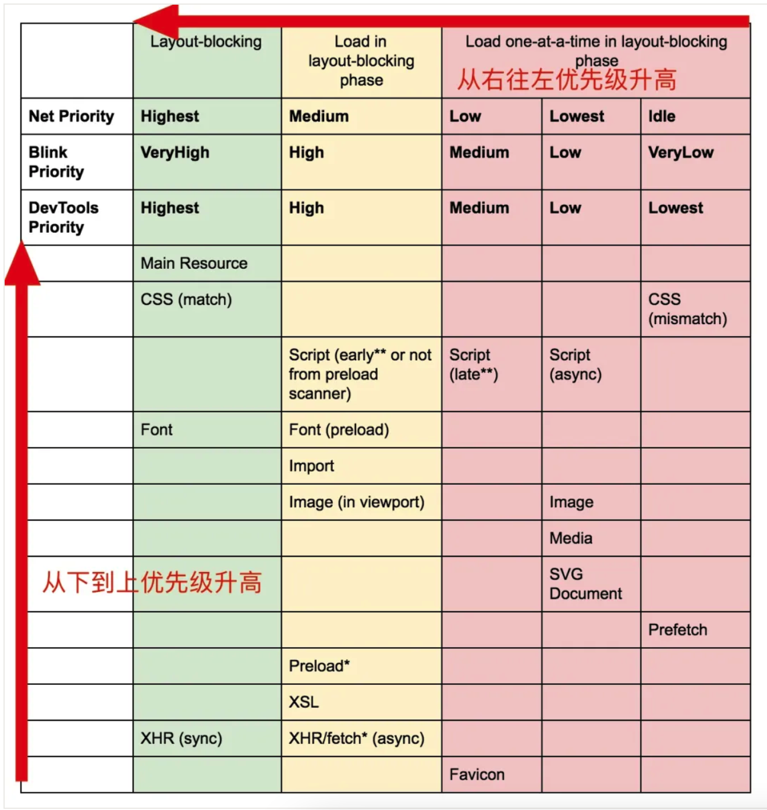
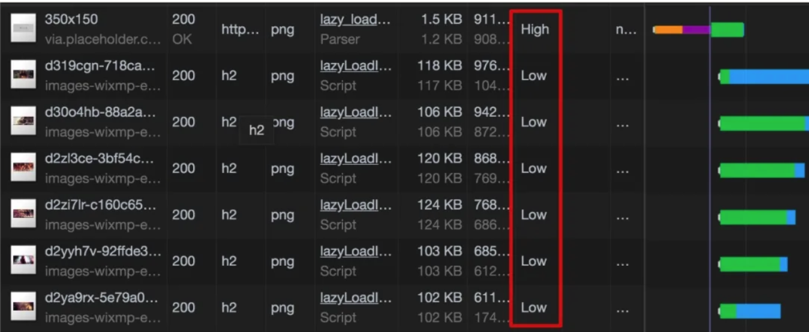

# 图片懒加载

## 图片懒加载的原理

在浏览器内部对于各种资源有着一套自己的优先级定义，浏览器会优先加载优先级高的资源。

如果我们不去进行图片的懒加载，默认情况下，资源的priority如下。



这些优先级标记为high的图片会占用其他资源的下载带宽，可能会造成某些比较关键的资源（比如xhr call）加载缓慢，拖慢页面速度。

## 图片懒加载的简单实现

图片懒加载的思路一般时当页面加载时加载一个尺寸很小的占位图片（1kb以下），然后再通过js选择性的去加载真正的图片。

一个最简单的的实现如下：

``` html
<!-- index.html -->  
```

``` css
// index.css

  img[src] {
      filter: blur(0.2em);
  }

  img {
      filter: blur(0em);
      transition: filter 0.5s;
  }
```

``` javascript
(function lazyLoad(){
    const imageToLazy = document.querySelectorAll('img[src]');
    const loadImage = function (image) {
        image.setAttribute('src', image.getAttribute('src'));
        image.addEventListener('load', function() {
            image.removeAttribute("src");
        })
    }

    imageToLazy.forEach(function(image){
        loadImage(image);
    })
})()
```

通过懒加载之后，资源优先级如下。



## 图片懒加载的进阶实现–滚动加载

上面的方案并不完美，对于用户来说，不在视窗中的图片可能根本不是用户当前关心的图片，所以我们可以让这些图片出现在用户视窗中再进行加载。

运用Intersection Observer 我们可以做到当图片滚动到视窗后再加载该图片。

``` javascript
(function lazyLoad(){
    const imageToLazy = document.querySelectorAll('img[src]');
    const loadImage = function (image) {
        image.setAttribute('src', image.getAttribute('src'));
        image.addEventListener('load', function() {
            image.removeAttribute("src");
        })
    }


    const intersectionObserver = new IntersectionObserver(function(items, observer) {
        items.forEach(function(item) {
            if(item.isIntersecting) {
                loadImage(item.target);
                observer.unobserve(item.target);
            }
        });
    });

    imageToLazy.forEach(function(image){
        intersectionObserver.observe(image);
    })
})()
```

上面的这些demo都在https://github.com/hateonion/lazy-load 这个repo里面。

## 如何选择合适的Placeholder图片

在上面的demo中我们使用了placeholder图片，实际上，图片所占的位置是否确定对于我们选择placeholder图片有着很大的影响。

### 图片尺寸已知

图片尺寸已知出现的场景一般是博文的题图或者网站中一些固定尺寸的thumbnail，这些图的尺寸一般固定且一般不会发生改变。对于这种场景，我们可以加载对应尺寸的placeholder图片（如上一节的demo）。我们可以自己裁剪对应尺寸的的placeholder图片或者使用类似http://placeholder.com/ 这样的服务来获取placeholder图片。

### 图片尺寸未知

图片尺寸未知的情况下一般我们需要生成对应的thumbnail然后去加载我们生成的thumbnail去做placeholder。为了生成这些thumbnail你可以调用imagemagick或者调用一些在线的图片分割服务（比如七牛）

### 懒加载防止布局抖动

在图片懒加载时，由于图片的尺寸不定，浏览器难以计算需要给图片预留出的位置。所以当图片加载完成后会出现网页布局的抖动。
(image from From http://davidecalignano.it/lazy-loading-with-responsive-images-and-unknown-height/)

即使我们选择的placeholder很小，可以在毫秒级别完成下载，用户可能意识不到布局的抖动。但是在一些性能比较差的设备上，这种布局的抖动还是会一定程度上影响用户的体验。为了完全避免布局闪动，我们可以采用aspect ratio boxes 的技术来制作一个占位用的元素。
<div class="lazy-load__container feature">
  
</div>
.lazy-load__container{
    position: relative;
    display: block;
    height: 0;
}

.lazy-load__container.feature {
    // feature image 的高宽比设置成42.8%
    // 对于其他图片 比如 post图片，高宽比可能会不同，可以使用其他css class去设置
    padding-bottom: 42.8%;
}

.lazy-load__container img {
    position: absolute;
    top:0;
    left:0;
    height: 100%;
    width: 100%;
}
结果

上面这个实现的原理其实很简单，由于 padding-bottom (或者 padding-top)声明为百分比时是根据元素生成的box的 width 去计算百分比的，所以我们通过padding-bottom去声明一个对应高宽比的container。而这个container的具体尺寸会由尺寸确定的外层元素确定，但是高宽比始终保持一致。
而图片的尺寸设置成100%container的尺寸保证图片始终和container的尺寸保持一致。
需要注意的是上面这个方法并不能适配图片比例不一致的网站（比如本站），不过好在，为了用户体验，现在绝大多数网站的图片比例都有明确的要求，绝大多数情况下我们只适配保证网站常用的的几种图片宽高比例即可。
像Medium一样懒加载图片

Medium的懒加载图片的体验相信去 Medium 读过文章的同学都体验过了，可以说是非常的流畅。而其背后的技术其实也就是我们上面讲到的几种技术的组合。
使用 aspect ratio box 创建占位元素。
在html解析时只加载一个小尺寸的图片，并且添加blur效果。
最后使用js选择性的加载真实图片。
Demo 如下 codePen by José M. Pérez
总结

懒加载用户当前视窗中的图片可以提升页面的加载性能。
懒加载的思路是在html解析时先加载一个placeholder图片，最后再用js选择性的加载真实图片。
如果需要滚动加载可以使用 Intersection Observer 。
对于固定尺寸和不定尺寸的图片，我们可以选择不同的服务去或者placeholder图片。
对于图片尺寸不确定引起的布局抖动问题我们可以使用 aspect ratio box 来解决。
参考资料