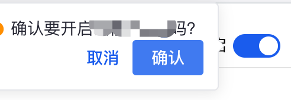

# Element-ui 的 Switch 和 Popconfirm 配套使用问题

> * 场景: 在使用`switch`控件时,`vue`点击之后直接就会状态发生改变，但是实可能这样:
    - 这个状态如果需要调取接口来确认状态
    - 二次确认弹窗再确定状态是否更改



之前的做法是，`switch`控件的change事件中打开弹窗，这时候页面显示的控件状态已经发生了改变，这时候取消弹窗再将状态改回来，如果这时候点击了页面空白区域，弹窗组件消失了，这个状态就不好改变了。

一个巧妙的办法是，现将`switch`控件的状态设置为`disabled`,然后利用 `Popconfirm` 或者 `click` 事件进行事件操作，由于vue是双向数据绑定，改变后再改变数据状态，避免了状态管理混乱，页面显示不正确情况。
另外设置 `disabled` 需要改变组件默认ui。

``` html
<el-popconfirm
    confirm-button-text="确认"
    cancel-button-text="取消"
    @confirm="confirmTraceStatus"
    placement="left"
    :title="`确认要${ traceStatus ? '关闭' : '开启' }吗？`"
>
    <el-switch
        slot="reference"
        disabled
        class="trace-switch"
        v-model="traceStatus"
    />
</el-popconfirm>
```

``` less
.trace-switch {
      .el-switch__core, .el-switch.is-disabled .el-switch__label {
          cursor: pointer !important;
      }
  }
```
