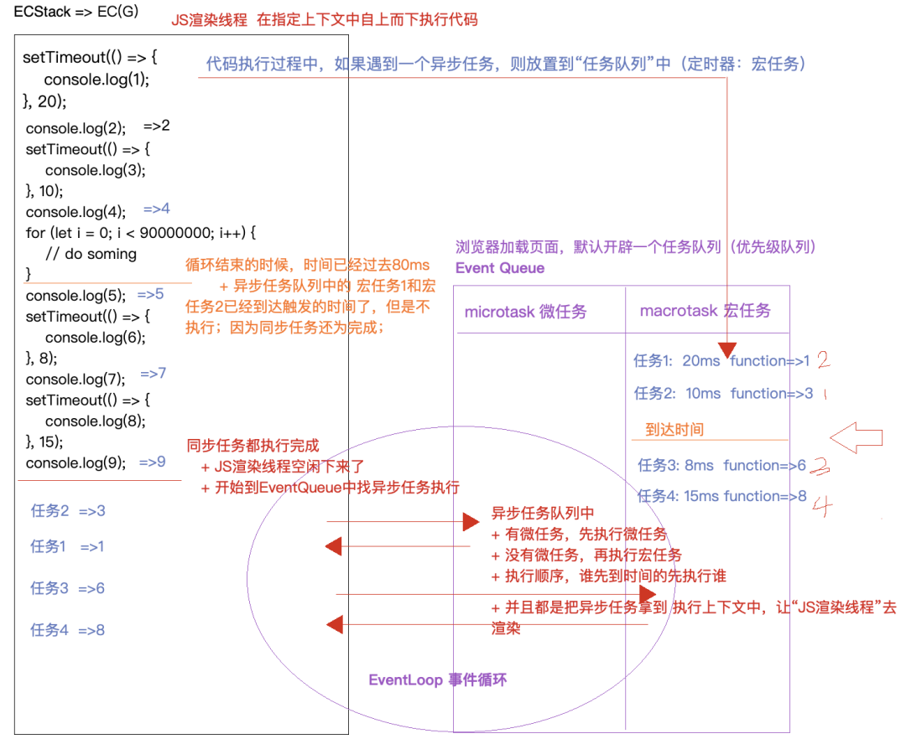

# 同步异步编程和EventLoop底层机制

## 1､JS是单线程的，怎么达到异步编程

- 1)JS是单线程的，大部分代码都是同步编程。

- 2)JS中利用浏览器的多线程机制，基于单线程的EventLoop（事件循环机制）实现出异步的效果。

## 2､event loop (微任务与宏任务)

- 1)微任务 （microtask）：优先级高，并且可以插队，不是先定义先执行。包括：promise.then，async/await [generator]，requestAnimationFrame，observer，MutationObserver，setImmediate。

- 2)宏任务 （macrotask）：优先级低，先定义的先执行。包括：ajax，setTimeout，setInterval，事件绑定，postMessage，MessageChannel（用于消息通讯）。

## 3､根据事件循环机制，重新梳理一下流程

- 先找微任务队列，如果微任务队列中有，先从微任务队列中，一般按照存放顺序获取并且去执行。

- 如果微任务队列中没有，则再去宏任务队列中查找，在宏任务队列中，一般是按照谁先到达执行的条件，就先把谁拿出来执行。

## 常考面试题：EventLoop事件循环

#### 面试题1

``` javascript
console.log('1') // 1

async function async1() {
  console.log('2') // 2
  await setTimeout(() => {
    console.log('3') // 8
  }, 0)
  console.log('4') // 5
}

setTimeout(() => {
  console.log('5') // 7
}, 0)

async1()

new Promise(function (resolve) {
  console.log('6') // 3
  resolve()
}).then(function () {
  console.log('7') // 6
})

console.log('8') // 4
// 结果：1 2 6 8 4 7 5 3
```

#### 面试题2

``` javascript
async function async1() {
    console.log('async1 start'); // 2
    await async2();
    console.log('async1 end'); // 6
}
async function async2() {
    console.log('async2'); // 3
}
console.log('script start'); // 1
setTimeout(function () {
    console.log('setTimeout'); // 8
}, 0)
async1();
new Promise(function (resolve) {
    console.log('promise1'); // 4
    resolve();
}).then(function () {
    console.log('promise2'); // 7
});
console.log('script end'); // 5
//结果：
script start
async1 start
async2
promise1
script end
async1 end
promise2
setTimeout
```

#### 面试题3

``` javascript
console.log(1); // 1
setTimeout(() => {
  console.log(2); // 6
  Promise.resolve().then(data => {
     console.log(3); // 7
  });
});
new Promise((resolve) => {
  resolve()
  console.log(4) // 2
}).then(() => {
  console.log(5); // 4
  setTimeout(() => {
    console.log(6); // 8
  });
}).then(() => console.log(7)) // 5
console.log(8); // 3

// 结果：1, 4, 8, 5, 7, 2, 3, 6
// 1, 4, 8 是同步  5, 7  是微任务  2 宏任务 3 微任务  6 宏任务
```

## 进程/线程

- 1) 进程代表的是一个程序（浏览器开一个页卡 (Tab页) 就是一个进程）；

- 2) 线程是用来处理处理进程中的具体事物的，如果一个程序中需要同时做好多事情，就需要开辟好多线程；

- 3) 一个线程同时只能做一件事情；

### 官方的说法

- 1) 进程是cpu资源分配的最小单位（是能拥有资源和独立运行的最小单位）。

- 2) 线程是cpu调度的最小单位（线程是建立在进程的基础上的一次程序运行单位，一个进程中可以有多个线程）。

## 浏览器是多线程的

- 1) 浏览器是多进程的;

- 2) 浏览器之所以能够运行，是因为系统给它的进程分配了资源（cpu、内存）;

- 3) 简单点理解，每打开一个Tab页，就相当于创建了一个独立的浏览器进程;

### GUI渲染线程

- 1) 负责渲染浏览器界面，解析HTML，CSS，构建DOM树和RenderObject树，布局和绘制等。

- 2) 当界面需要重绘（Repaint）或由于某种操作引发回流(reflow)时，该线程就会执行。

- 3) 注意，GUI渲染线程与JS引擎线程是互斥的，当JS引擎执行时GUI线程会被挂起（相当于被冻结了），GUI更新会被保存在一个队列中等到JS引擎空闲时立即被执行。

### JS引擎线程

也称为JS内核，负责处理Javascript脚本程序。（例如V8引擎）

- 1) JS引擎线程负责解析Javascript脚本，运行代码。

- 2) JS引擎一直等待着任务队列中任务的到来，然后加以处理，一个Tab页（renderer进程）中无论什么时候都只有一个JS线程在运行JS程序。

- 3) 同样注意，GUI渲染线程与JS引擎线程是互斥的，所以如果JS执行的时间过长，这样就会造成页面的渲染不连贯，导致页面渲染加载阻塞。

## JS中的单线程异步编程

> JS是单线程的：浏览器只分配一个线程用来渲染JS代码。

1. JS中的代码大部分都是“同步编程”：上面的任务没有处理完成，下面的任务是无法处理的。
2. 但是JS中利用浏览器的多线程机制，可以规划出“异步编程”效果。

- 定时器
- ajax/Fetch/跨域 (HTTP网络请求)
- 事件绑定
- Promise中异步编程
- Generator / yield
- async / await

### 计算程序执行的时间(预估)

- 1）运行监控 console.time/timeEnd（受当前电脑运行环境的影响）
- 2）大O表示法(提前预估)

``` javascript
console.time('AAA'); 
for (let i = 0; i < 99999999; i++) {} 
console.timeEnd('AAA');
```

> 真实项目中应该避免死循环

``` javascript
while (true) {}
console.log('OK'); // 不执行：上述的死循环一直占用这“JS渲染线程”，线程空闲不下来，就处理不了其他的事情
```

## 定时器的异步编程

- 1）设置定时器任务是同步的
- 2）“间隔interval这么长时间，执行定时器绑定的函数” 这个任务是异步的
- 3）遇到异步任务，浏览器不会等待它执行完，则继续渲染下面的代码；当等到下面代码运行完，时间也到达了执行的条件，才会把异步任务执行；

``` javascript
setTimeout(() => {
    console.log("OK"); //2
}, 1000);
console.log('NO'); //1
```

> interval设置为零也不是立即执行，而是浏览器都有“最快反应时间（谷歌:5~6ms IE:13~17ms）”，设置为零，最快也需要等到5～6ms左右

``` javascript
setTimeout(() => {
    console.log('OK'); //2
}, 0);
console.log('NO'); //1
```

### 异步编程

``` javascript
setTimeout(() => {
    console.log(1);
}, 20);
console.log(2);
setTimeout(() => {
    console.log(3);
}, 10);
console.log(4);
console.time('AA');
for (let i = 0; i < 90000000; i++) {
    // do soming
}
console.timeEnd('AA'); //=>AA: 79ms 左右
console.log(5);
setTimeout(() => {
    console.log(6);
}, 8);
console.log(7);
setTimeout(() => {
    console.log(8);
}, 15);
console.log(9);
// 结果：2,4,5,7,9,3,1,6,8
```

图分析:



> 执行顺序：同步任务 —> 微任务 —> 宏任务 （微任务、宏任务在EventQueue）

> 细节: 当栈中的“同步任务”或者其它任务没有执行完之前，JS渲染线程不会空闲下来，些时哪怕定时器已经到达指定时间，也不会执行的。 “JS是单线程的，一次只能做一件事情” => 定时器设定的等待时间是最快触发执行的时间，很多时候，到时间不一定会执行，只有JS渲染线程空闲下来才会执行。
