### console用法

##### 基本打印信息console.log（）| info（）| debug（）| warn（）| error（）
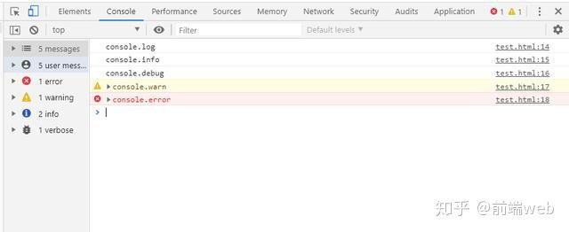;
控制台日志/信息/调试/警告/错误.

#### 将CSS添加到控制台消息
> 您的所有控制台消息看起来都一样吗？好吧，从现在开始，情况会有所不同，让您的日志看起来更吸引人，因为这对您而言最重要。
``` javascript
// 通过在文字前加上 ‘%c’, 然后在后方写入css设置即可将console。log加上CSS样式
console.log('%c这是示例的文字-Tz','color:pink;font-size:50px;font-weight: 500')
console.log('%c这是示例的文字-Tz','color:red;font-size:20px;font-weight: 600')
console.log('%c这是示例的文字-Tz','color:blue;font-size:12px;font-weight: 700')
```
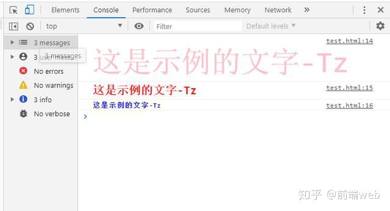;
----
#### 2|0如何为日志消息中的特定单词涂上颜色？就看这里~
``` javascript
// 通过在文字前加上 ‘%c’, 然后在后方写入css设置即可将console。log加上CSS样式
console.log('哪有人就哪有江湖 相持相扶%c--Tz张无忌',
　　　　　　　　'background-color:#222;font-size:24px;font-weight: 500;color:#bada55')
```
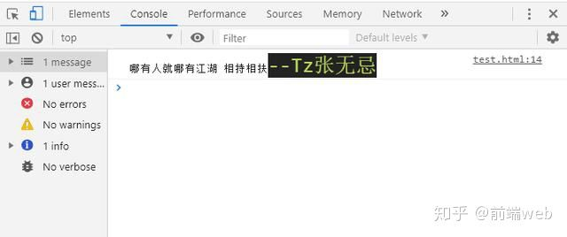;
``` javascript
console.dir（）
// 打印指定对象的JSON表示形式。
const zhangwuji = {
name: '张无忌',
age: 3,
tel: 'https://www.cnblogs.com/zhaohongcheng/'
}
console.log(zhangwuji)
```
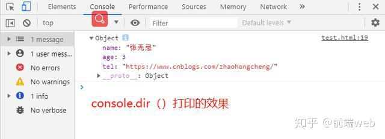;
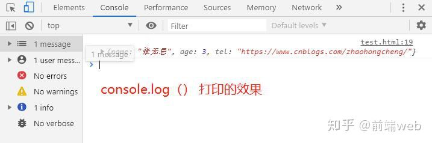;
----
#### 控制台中的HTML元素
就像检查元素一样，在控制台中获取HTML元素。
``` javascript
let zhangwuji = document.getElementsByTagName('body')[0]
console.log(zhangwuji)
```
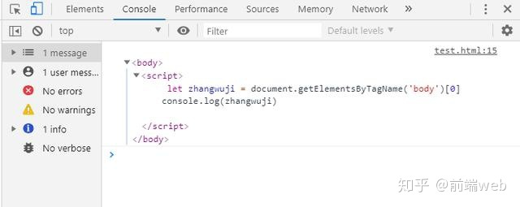;

#### console.table（）
``` javascript
// 是否想以正确且易于理解的方式查看JSON？ 
const bolg =[
{
name: '张无忌',
age: 3,
tel: 'https://www.cnblogs.com/zhaohongcheng/'
},
{
name: '令狐冲',
age: 12,
tel: 'https://www.baidu.com'
},
{
name: '扫地僧',
age: 22,
tel: 'https://www.didi.com'
}
]
console.table(bolg)
```
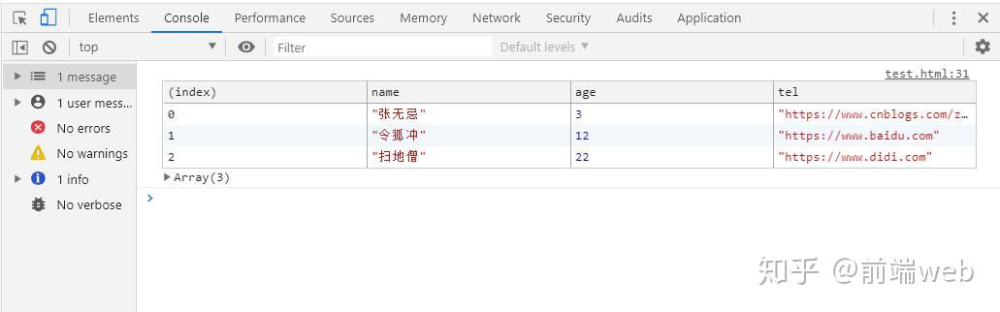;
---

#### console.group（）和console.groupEnd（）
``` javascript
// 很有可能用控制台将消息分组
// 利用console.group()和console.groupEnd()将console.log分成一组一组
console.group();
console.log('Dream')
console.groupEnd()
console.group();
console.log('5')
console.log('2')
console.log('1')
console.groupEnd()
console.group();
console.log('1')
console.log('3')
console.log('1')
console.log('4')
console.groupEnd()
```
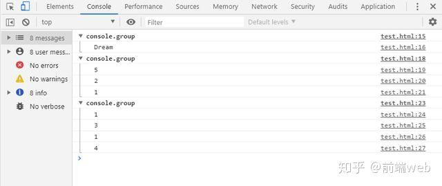;
---

#### console.count（）

- 此函数记录此特定调用count()已被调用的次数。该函数带有一个可选参数label。
- 如果label提供了该函数，则该函数记录该count()特定调用的次数label。
- 如果label省略，则函数记录在此特定行count()上被调用的次数。
``` javascript
for (let i = 0; i < 11; i++) {
console.count();
}
```
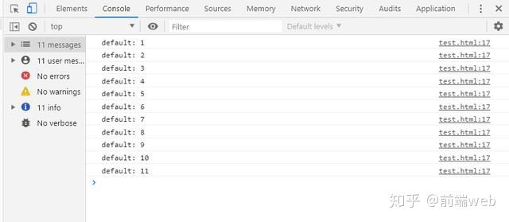;
---

#### console.assert（）

> 当您只想打印一些选定的日志时，这非常方便，例如，它将仅打印false参数。如果第一个参数为true，则完全不执行任何操作。
``` javascript
const errorMsg = '不符合';
for (let number = 2; number <= 5; number += 1) {
console.assert(number % 2 === 0, {number: number, errorMsg: errorMsg});
}
```
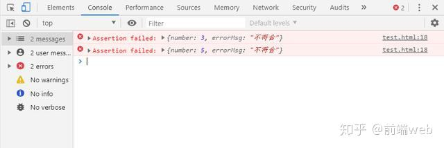;
---

#### console.time()
> console.time（）是一个专用于跟踪操作所花费时间的函数，它是跟踪JavaScript执行所花费的微时间的更好方法。
``` javascript
console.time("This");
let total = 0;
for (let j = 0; j < 10000; j++) {
total += j
}
console.log("Result", total);
console.timeEnd("This");
```
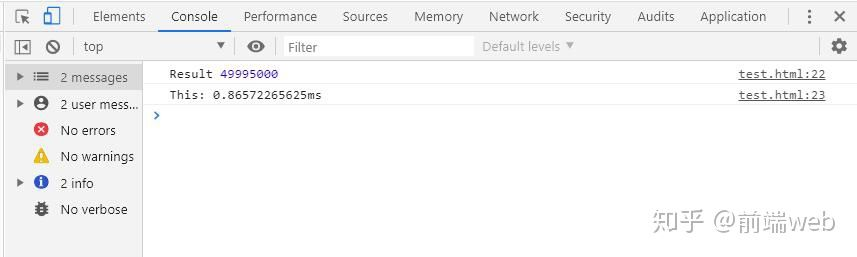;
---
